This depository contains projects and notes from my node.js bootcamp

- ## Node Farm - Project

  - Read/write files synchronously and asynchronously with module `fs`
  - Create a web server, routing, API, handle requests using module `http`
  - Create query object from url parameters using module `url`
  - Use `npm` as project manager and install other 3rd party modules

- ## Back-End Web Development - Notes

  - ### How the Web Works:
    - 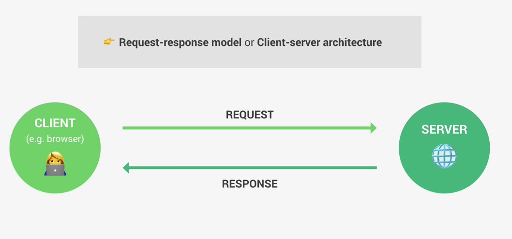
    - When we enter a web address to the browser, the browser send a request to the DNS (Domain Name System). This DNS server then lookup the website address to find its real IP address. This happens through ISP (Internet Service Provider)
    - 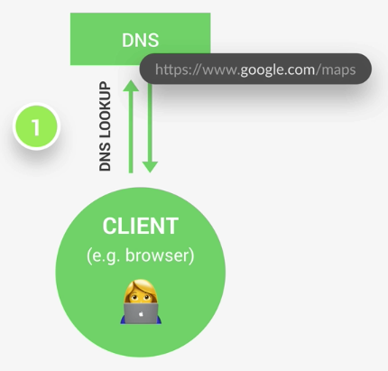 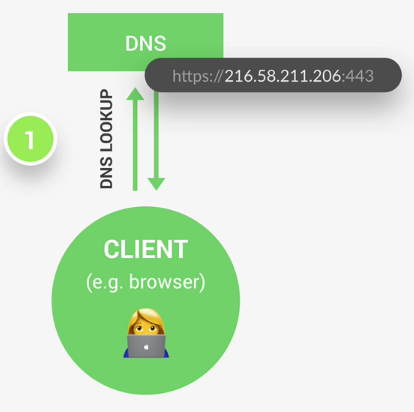
    - 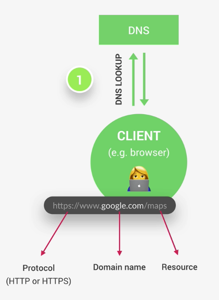 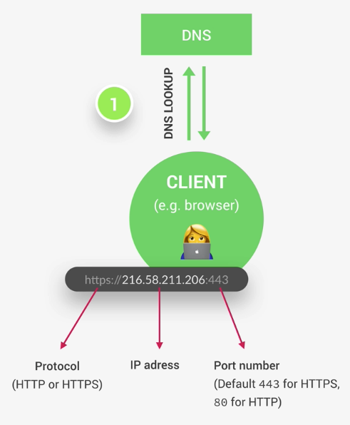
    - Port number: identify a specific service running on a server (a sub-address). Port number has nothing to do with the resources that we want to access. That resource will be sent over in the http requests
    - Once we have the real web ID addresses, a TCP/IP socket connection is established between the browser and the server. This connection is kept alive until the browser get all the files from the response
      - 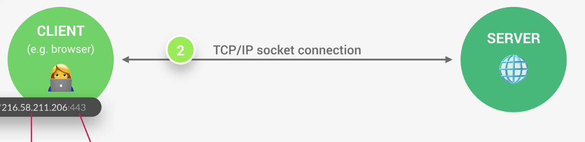
      - TCP/IP is a communication protocol defined how data is transfered across the web.
      - TCP breaks up the requests/responses into thousand of small chucks called packages before they are sent by IP. Once they arrive at the destination, TCP reassembles the packages into the original request/response. TCP wants to make sure the message travels as fast as possible.
      - IP's job is to send and route the packages to its destination through the internet. IP ensures the packages arrives where they're supposed to based on each package's IP address
    - After having the TCP/IP socket connection, the browser send a http request to the server
      - 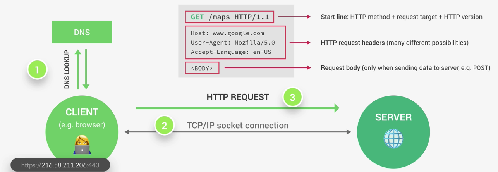
      - HTTP are communication protocol defined how clients and servers talk to each other. Here, the clients send a request and the server return a response
    - Once the server done process the request, it'll send back a http reponse
      - It is the developer that set up what to send back like the headers `res.writeHeader` and the body `res.end`. The body usually contains the html of the website requested or json coming back from an API
      - 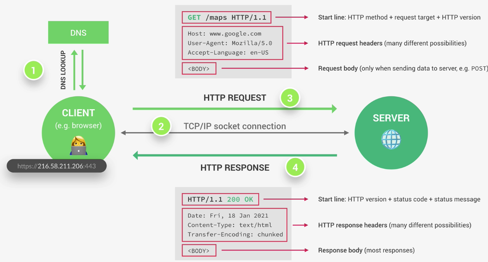
    - When a client requests a website, there are actually a lot of requests
      - 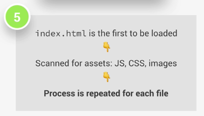
  - ### Front-End vs Back-End Web Development
    - Front-End: Everything happens in the web browser. It's about designing and building the final website that's gonna be visible to users. Front-End Stack: HTML, CSS, JS, React, Angular, etc
    - Back-End: what happens on the web server that's not visible to the end users. Back-End Stack: Node.js, mongoDB or PostgreSQL, Django
      - Static Web SERVER: A computer that's connected to the internet. It stores website files like HTML, CSS, images etc, and run a HTTP Server that understands http requests and responses. HTTP Server software is the part that communicate with a browser using requests and responses.
      - 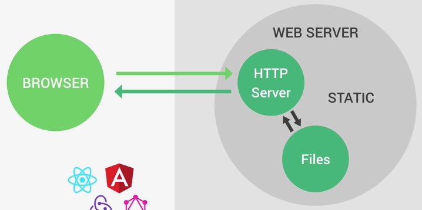
      - Dynamic SERVER: has an app running that talks to the database, http server, files etc
      - 
  - ### Static vs Dynamic WEBSITES vs API
    - Static websites
      - This website contains files like HTML, CSS, JS that the developer uploaded to the server. And when there's a request from a browser for the site, the server will send these exact files to the client. The looks and content will not change based on when you look browse the website. No communication to database at all.
      - 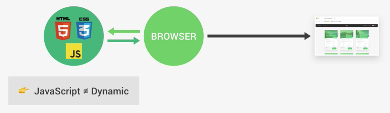
    - Dynamic websites
      - Dynamic websites are built on the server each time a request comes in. The application (like a node.js app) get data from the database (based on the request data) and then build the website based on the template. Then return the complete website to the browser. The website can change its content based on the data in the database or the action on the site. For example, the content on facebook/twitter is different when you're logged in or out.
      - Functionality in a web app: log in/out, searching, etc
      - Wordpress is a dynamic website but it doesn't have any functionality, users can only read
      - 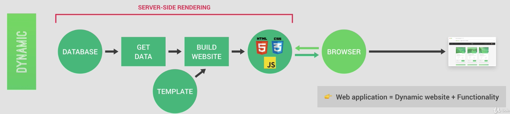
    - API powered websites
      - An app, like node.js app, gets data from the database, and then send data in json format to the browser. Then by using framework like React, Angular to build the website based on the data
      - So backend developers only need to build APIs and let frontend developers build the website (client-side rendered)
      - Advantage of APIs is that the data we get from APIs can be used on many different platforms like website, mobile apps, desktop apps, etc
      - 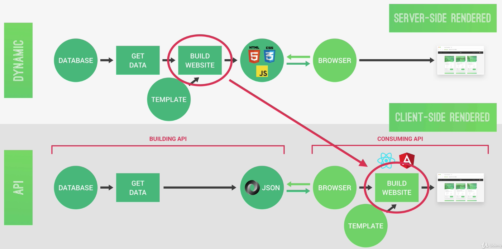

- ## How Node.js works: Behind the scenes - Notes

  - ### Node Architecture: Node, V8, Libuv & C++

    - 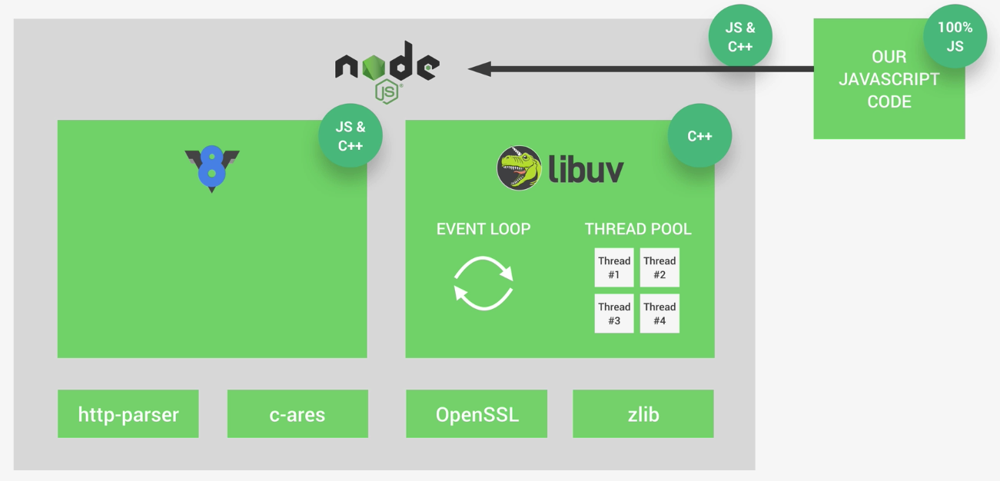
    - Node runtime depends on V8 & Libuv to work. Node.js combines these 2 libraries together and let developers access to Node.js library in pure JS.
      - Google's V8 Javascript engine helps Node understands JS code. V8 converts JS code to machine code so that machine can understand JS. V8 is written in JS and C++
      - `libuv` focuses on asynchronous input/output. `libuv` gives node access to the underline computer operating system, file system, networking, etc. `libuv` also implements 2 important features of Node. js: Event Loop & Thread Pool. Written in C++
        - Event Loop: handles easy tasks like executing callbacks and network IO
        - Thread Pool: handles more heavy works like file access or compression
    - Besides V8 and Libuv, Node.js also depends on http-parser, c-ares, OpenSSL, zlib

  - ### Processes, Threads and Thread Pool

    - 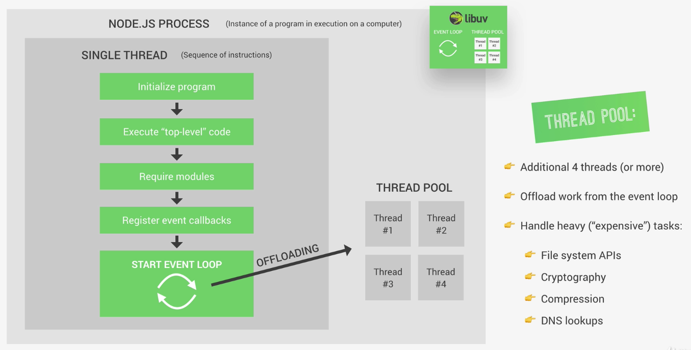
    - Top level code: code that's not inside any callbacks
    - Callbacks: for example, the callback function in http server in node-farm app
    - Some tasks are too heavy to run in the event loop, so the event loop offload those tasks to the thread pool provided by libuv. There are usually 4 additional threads in this thread pool and they are separate/independent of the single thread that contains the event loop

  - ### Event Loop

    - 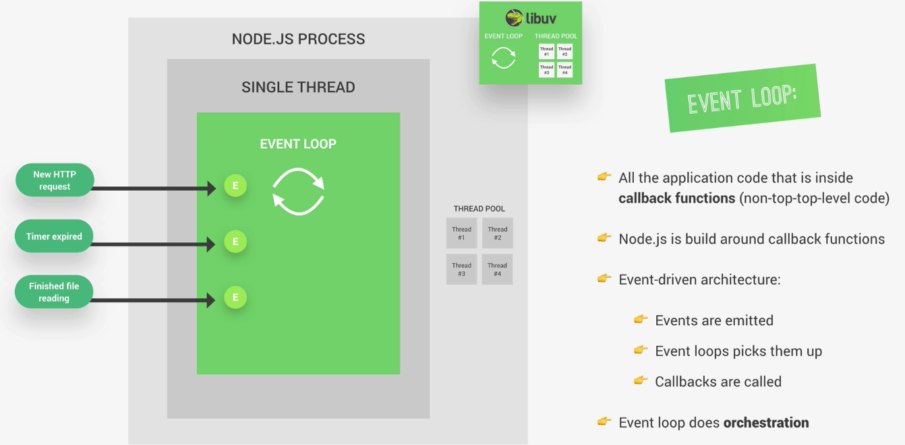
    - 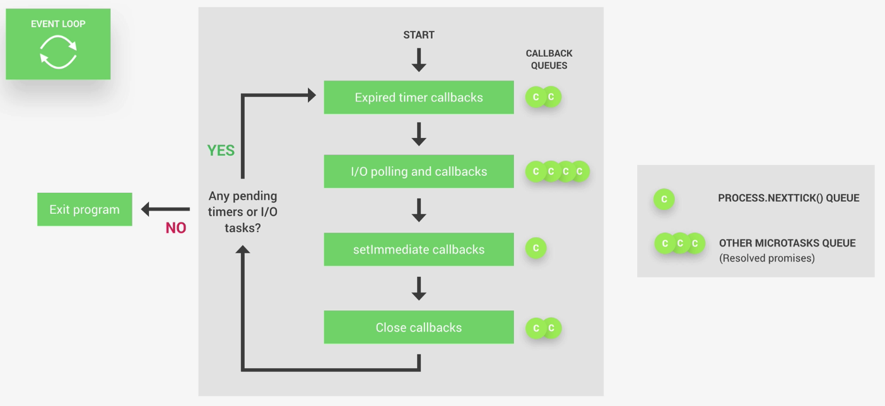

      - There are 4 phases in a tick of an event loop, each phase has its own callback queue. When entering a phase, the event loop will process all callbacks currently in the queue and then move on to the next phase. If there are any callbacks being added in the queue of a previous phase, they will only get processed once the event loop returns to that phase.
        - Expired timer callbacks: Processes callback functions from expired timer like the below example.
        ```js
        setTimeout(() => {
          console.log('Timer expired');
        });
        ```
        - I/O polling and callbacks: Polling means looking for new I/O events ready to be processed and putting them into the callback queue. In Node.js, I/O usually means networking, file accessing, etc.
        - `setImmediate` callbakcs: special timers being used when we need to process a callback right after I/O execution phase.
        - Close callbacks: close events are processed like web server/socket is shut down
      - There are 2 extra queues (`process.nexttick()` queue and microservices queue - Resolved promisses) that are being processed right after each phase ends if there are any callbacks in the queues.

    - 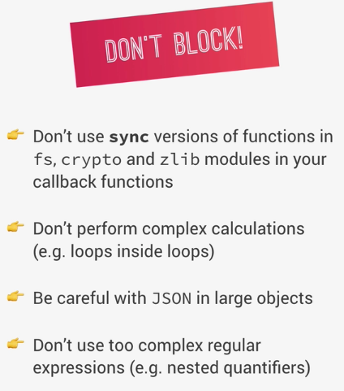

  - ### Events and Event-Driven Architecture

    - 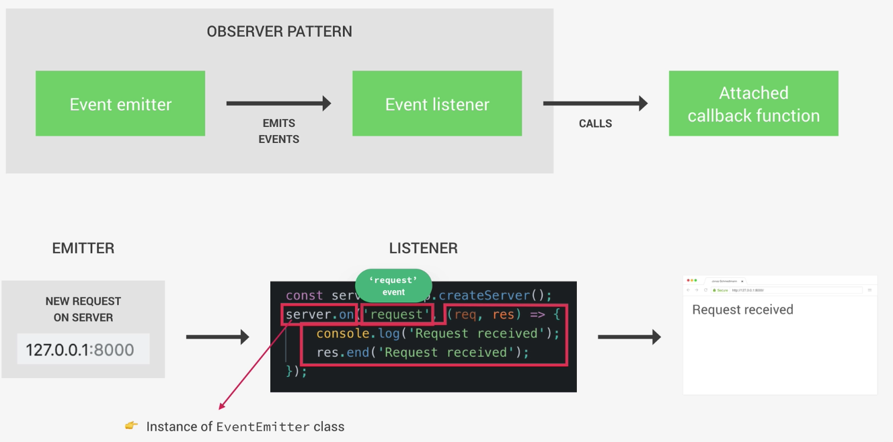
    - Most of Node.js core modules like file system, timers, http, etc. are built around event-driven architecture.
    - In Node.js, there're certain objects called Event emitter that emits named events as soon as something important happens such as a request hitting a server, a timer expiring, a file ready to read. These events are then being picked up by Event listeners set up by developers which will fire up callback functions attached to each listener.
    - Also called `Observer Pattern` in Javascript programming. Event listener keeps observing the object that eventually will emit an event. `Observer Pattern` is designed to react rather than to call.
    - Example:
      - The `server` created from `const server = http.createServer();` acts as an event emitter because it is an instance of EventEmitter class. The `server` automatically emits a `request` event everytime a request hits the server.
      - `server.on` method is how we set up a listener for a `request` event and the attached callback function will be called. It usually sends some data back to the client/browser

  - ### Streams

    - Streams are instances of `EventEmitter` class
    - Streams are used to process (read & write) data piece by piece (chunks), without completing the whole read or write operation => doesn't keep all data in memory.
      - Perfect for handling large volumes of data
      - More efficient data processing in terms of memory (no need to keep all data in memory) and time (don't have to wait untill all data is available)
      - Ex: Netflix, Youtube use Streams => called streaming
    - 4 different types of streams:
      - 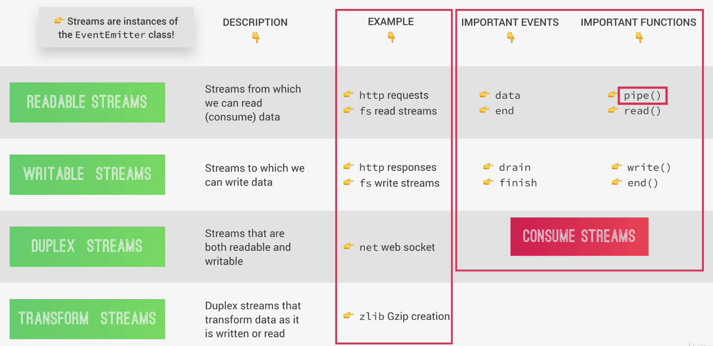

  - ### How Requiring Modules Works

    - Each JavaScript file is treated as a spearate module
    - Node.js uses the `CommonJS Module System`: `require()`, `exports` or `module.exports` because it works very well on the server.
    - `CommonJS Module System` is different from the native ecma script `ES module system` used in browsers (`import`/`export`)
    - Why in Node.js, each module has access to the `require()` function to import other modules? It's not a standard javascript function. Where does it come from? How does it work behind the scene?
      - 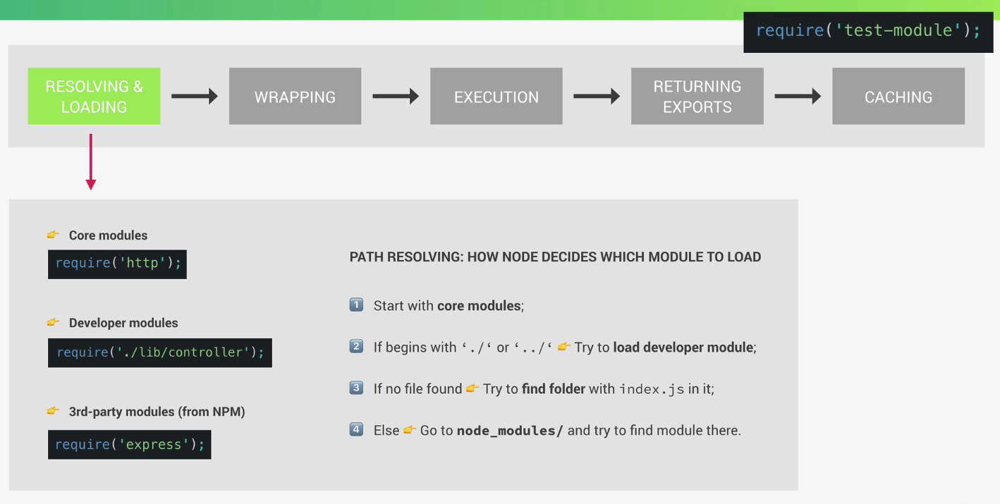
      - 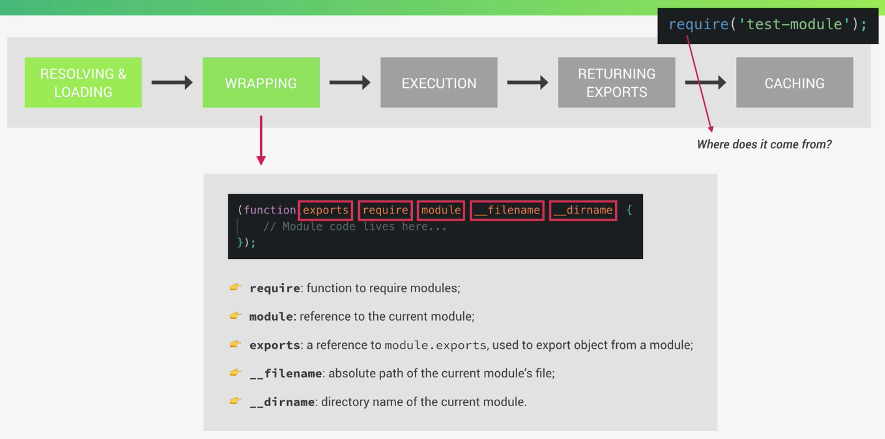
      - 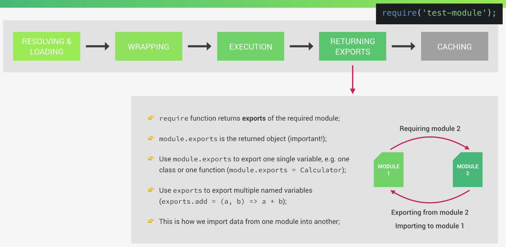
      - The imported module is cached so that when we need to import it again, node.js will get it from the cach insteading importing it all over again.

- ## Asynchonous JS - Small Project + Notes

  - Used `superagent` 3rd party module to create http requests which returns Promises
  - To prevent Callback Hell and increase readability, we can chain Promises with `then`, `catch` or better yet we can use `async`/`await`, `try` `catch`.
  - For methods that don't support Promises, we can create another function that will return a Promise that run the needed function.

- ## NATOURS - Project
