- ## Environment Variables

  - `Node.js` app can run in different environment such as development environment or production environment.
  - Depending on which environment it's running on, we can have different setting like turning on/off debugging/logging, using different databases, etc. These settings are setup in the environment variables.
  - By default, `express` sets the environment to development
  - We can check which environment the express app is running on by `app.get('env')`. This `env` variable is set by express
  - Node.js also set many environment variables at `process.env`. The `process` module comes from CORE modules. It's available to all module and we don't need to require it.
  - In express, many packages depends on the environment variable called `NODE_ENV`, which defines whether we're in development or production mode, but express do not define this variable so we have to do that manually. Set environment variable using:
    - Command line or a script in package.json: `NODE_ENV=development nodemon server.js` or
    - Write a `config.env` file:
      ```
      NODE_ENV=development
      PORT=8000
      USER=ngan
      PASSWORD=123456
      ```
      - For Node.js to access those environment variables in `config.env`, we use a 3rd party package call `dotenv` `npm i dotenv`. After running `dotenv.config({ path: './config.env' });` in `server.js`, `process.env` now will include all variables above
  - <a href="https://github.com/ngannguyen117/Node.js-Bootcamp/commit/920d8f075b63fecf933b8fc6d0583d18d0d7e2e0">Commit Link</a>

- ## EXPRESS

  - 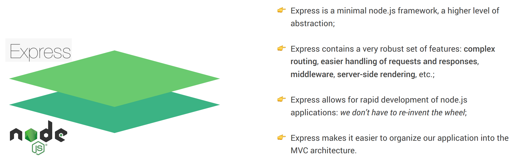
  - Install with npm: `npm i express@4`
  - It is a convention to have all express configuration in `app.js`
  - <a href="https://github.com/ngannguyen117/Node.js-Bootcamp/commit/59e1b0bbefa2476c59b13403f30b1b210c23055d">Basic Routing with Express</a> In `app.js`:
    - `express` is a function that upon calling will add a bunch of methods to the `app` variable
      ```js
      const express = require('express');
      const app = express();
      app.listen(3000, () => {}); // To start up a server at port #3000
      ```
    - We need to define routes. Routing means how the application responds to the client's requests (certain urls & HTTP methods used for that request)
    - `get`: HTTP GET method, `'/'`: Endpoint/URL, the rest is the callback function (called `route handler`) with request and response object parameters. `.json` automatically sets the `Content-Type: application/json` while `.send` only sends text.
      ```js
      app.get('/', (req, res) => {
        res
          .status(200)
          .json({ message: 'Hello from the server side', app: 'Natours' });
      });
      ```
  - <a href="https://github.com/ngannguyen117/Node.js-Bootcamp/commit/897f1a90b031a3587644b7cbd3e1f43446e4625b">APIs and RESTful API Design</a>

    - API: Application Programming Interface - A piece of software used by another piece of software to allow applications to talk to each other. APIs aren't only used to send data and not always related to web development. `Application` can mean many other things as long as the piece of software relatively stands alone. For example: `fs`, `http` modules in Node.js are APIs <= Node APIs, Browser's DOM JS API, etc.
    - The REST Architecture: REpresentational State Transfer - a way of building web APIs in a logical way making them easy to consume
      - 
      - 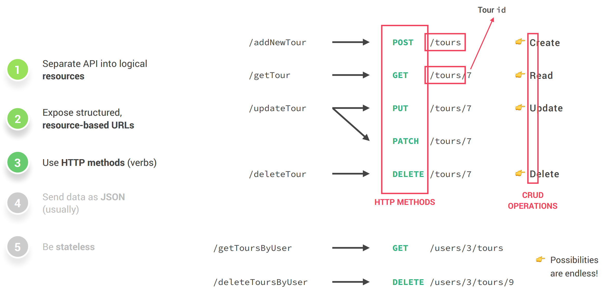
      - 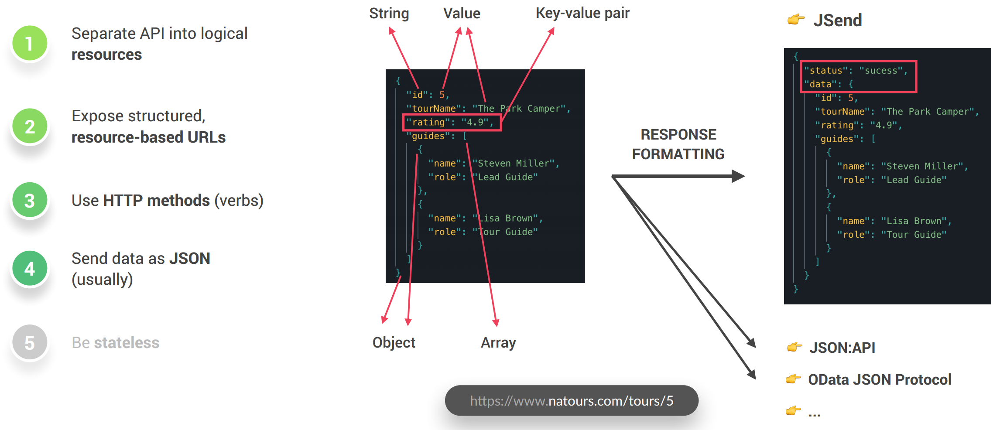
      - 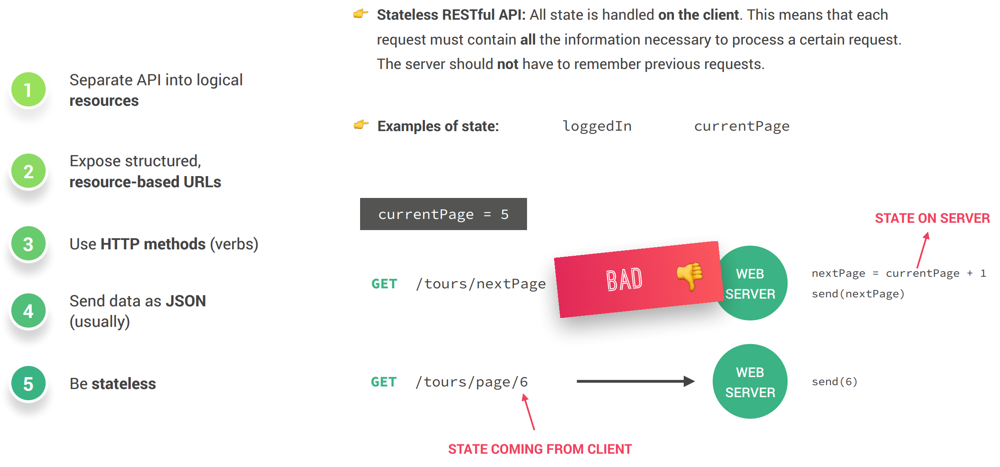
    - Simple <a href="https://github.com/ngannguyen117/Node.js-Bootcamp/commit/66c91c7012151a95f8040e6ed36264b64252c2c4">GET</a>, <a href="https://github.com/ngannguyen117/Node.js-Bootcamp/commit/c0055573f21d10942147c1f4b4423b27d72d6c68">POST</a>, <a href="https://github.com/ngannguyen117/Node.js-Bootcamp/commit/d2c3a1ccc827bc1e96a987a7a2de7d91c8ad167b">PATCH</a>, <a href="https://github.com/ngannguyen117/Node.js-Bootcamp/commit/8caf015c45bb4644827188eb5544e3029ba492aa">DELETE</a> Requests at Endpoint `'/api/v1/tours`

      ```js
      app.use(express.json());

      const tours = JSON.parse(
        fs.readFileSync(`${__dirname}/dev-data/data/tours-simple.json`)
      );

      app.get('/api/v1/tours', (req, res) => {
        res.status(200).json({
          status: 'success',
          results: tours.length,
          data: { tours },
        });
      });

      app.post('/api/v1/tours', (req, res) => {
        const newID = tours[tours.length - 1].id + 1;
        const newTour = Object.assign({ id: newID }, req.body);
        tours.push(newTour);
        fs.writeFile(
          `${__dirname}/dev-data/data/tours-simple.json`,
          JSON.stringify(tours),
          (err) => {
            res.status(201).json({
              status: 'success',
              data: { tour: newTour },
            });
          }
        );
      });
      ```

      - In the `POST` request `req` parameter, out of the box, `express` doesn't have access to the body of the POST request so we need to use middleware `app.use(express.json())`. Middleware is a function that can modify the incoming request data. It's called middleware because it stands between the request and response. `express.json()` is the middleware that helps express app to access the request body and that data is added to the request object.
        - 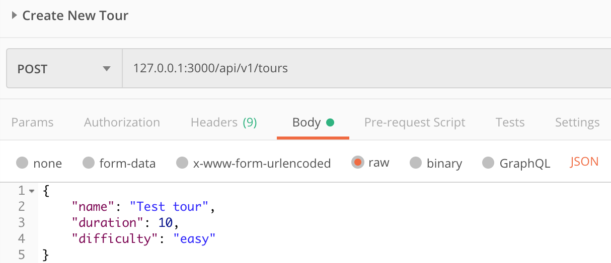
      - <a href="https://github.com/ngannguyen117/Node.js-Bootcamp/commit/7ff03a8df314a53afc5a3ee7703167790b79bd6e">Accessing to URL Parameters</a>.
        - In the below example, we added `/:id` to the endpoint because we want to get the tour with id = 14 with this endpoint `/api/v1/tours/14`.
        - The value of `req.params` would be something like `{ id: '14' }`.
        - If there are more parameters, we can add more like `/:id/:x/:y` => `{ id: '14', x: '1', y: '2' }`, if we want to make one of the parameters optional, we can add `?` like `/:id/:x/:y?` => `{ id: '14', x: '1', y: undefined }`
        ```js
        app.get('/api/v1/tours/:id', (req, res) => {
          const id = req.params.id * 1;
          if (id > tours.length) {
            return res.status(404).json({
              status: 'fail',
              message: 'Invalid ID',
            });
          }
          const tour = tours.find((element) => element.id == id);
          res.status(200).json({
            status: 'success',
            data: { tour },
          });
        });
        ```

    - <a href="https://github.com/ngannguyen117/Node.js-Bootcamp/commit/0d76673339f0bb7b8cd63a49fe7d3580d7750ab3">Refactoring Routes</a>

      To make the routes/endpoints clearer, we create separate functions for the request handlers and then pass them into respective HTTP methods. Additionally, we can use `.route(...)` of express app to show which methods we use for different routes.

      ```js
      app.route('/api/v1/tours').get(getAllTours).post(createTour);

      app
        .route('/api/v1/tours/:id')
        .get(getTour)
        .patch(updateTour)
        .delete(deleteTour);
      ```

    - <a href="https://github.com/ngannguyen117/Node.js-Bootcamp/commit/3d1384845708948070c63ed0299bdfc07f823f38">Middleware and the Request-Response Cycle</a>

      - 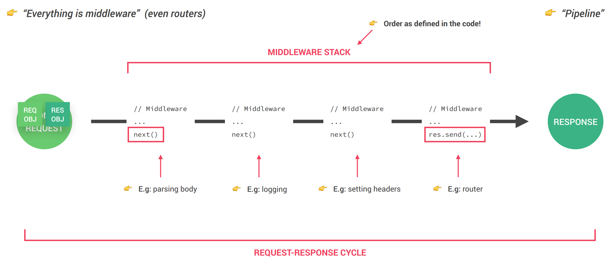
      - To apply a middleware to express app, we use `app.use` and pass a middleware handler in.
      - We can write our own middleware handler:
        - This handler/function has three parameters: request, response, and next. `next` is the next middleware. At the end of each handler, we always have to call `next()`, otherwise it will get stuck at the current middleware. The middleware in `app.use` will be applied to all requests below it
        - Example of a global middleware
          ```js
          app.use((req, res, next) => {
            req.requestTime = new Date().toISOString();
            next();
          });
          ```
      - Or use a 3rd-Party middleware.
        - Ex: `morgan` (`npm i morgan`)
        - => `app.use(morgan('dev'));`
        - => `GET /api/v1/tours 200 6.250 ms - 8681` - is printed in terminal

    - <a href="https://github.com/ngannguyen117/Node.js-Bootcamp/commit/3f84f36712f362f1c98bf6f9f0eabe793c9b6f49">Creating and Mounting Multiple Routers</a>

      - According to the RESTful architecture, each resource like tours or users should be an endpoint. So we'd want to create a route for each of the resources and put them in a separate file to make it easier to manage when the app gets bigger.
      - To make each resource a route, we use middleware `express.Router()`. Each of the resource now becomes a mini app having its own root
      - Once the request match the endpoint declared in `app.use(...)`, it will run the attached Router

        ```js
        const tourRouter = express.Router();

        tourRouter.route('/').get(getAllTours).post(createTour);
        tourRouter
          .route('/:id')
          .get(getTour)
          .patch(updateTour)
          .delete(deleteTour);

        app.use('/api/v1/tours', tourRouter);
        ```

    - <a href="https://github.com/ngannguyen117/Node.js-Bootcamp/commit/5ea2bd0e695bbb50b3a4eb81c81dc3205502cecc">Restructuring Files</a>

      - `server.js`: the starting file of this web app. This is where we starts the server and will include everything related to the server
      - `app.js`: will only include code related to express and global express middleware
      - 2 new folders created:
        - `routes`: to hold all the resources routers
        - `controllers`: to hold each router's handlers
      - We written an NPM script `"start": "nodemon server.js"` in `package.json` to start the Node.js app

    - <a href="https://github.com/ngannguyen117/Node.js-Bootcamp/commit/ffa6a4e674bd6bf3633fee1e1a325ded0ec5c37c">Param Middleware</a>

      - `router.param(parameterName, handler)` is a middleware that will run the handler if the request url has a param that matches the provided parameterName.
      - The signature of the handler function being passed to a param middleware:
        ```js
        (req, res, next, val) => {
          console.log(`The param value is ${val}`);
          next();
        };
        ```
      - In this commit, we created a `checkID` param handler in `tourController` to validate ID before calling the final handler. This `checkID` function is then called in `tourRoutes`'s `router.param`

    - <a href="https://github.com/ngannguyen117/Node.js-Bootcamp/commit/db5127b5027474ad2d19c4cf253ff59f624cab50">Serving Static Files by middleware `express.static`</a>
      - Static files are files in the file system that cannot be accessed using routes like the `overview.html` or images in the `public` folder.
      - For example, if we try to access `http://127.0.0.1:3000/public/overview.html` we will get an error because we didn't define any routes for that link
      - In order to access static files, we need to use middleware `app.use(express.static(`\${\_\_dirname}/public`));`
        - We want to serve all files in the `public` folder => `public` folder becomes the root folder of the app.
        - To access `overview.html` we have to remove public from the previous URL `http://127.0.0.1:3000/overview.html` because when express app cannot match that URL to any of the defined routes, it will go to the `public` folder to search for the file.
        - We can also access to an image in img folder by `http://127.0.0.1:3000/img/pin.png` but we will get an error if we try to access only the `img` folder `http://127.0.0.1:3000/img/` because it's not a file so express app will try to search for a matched route

- ## Setting up ESLint + Prettier in VS Code

  - Install these development dependency
    ```
    npm i eslint prettier eslint-config-prettier eslint-plugin-prettier eslint-config-airbnb eslint-plugin-node eslint-plugin-import eslint-plugin-jsx-a11y eslint-plugin-react --save-dev
    ```
  - Add rules to `.eslintrc.json`

- ## MongoBD

  - 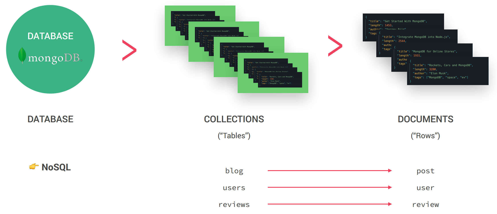
  - 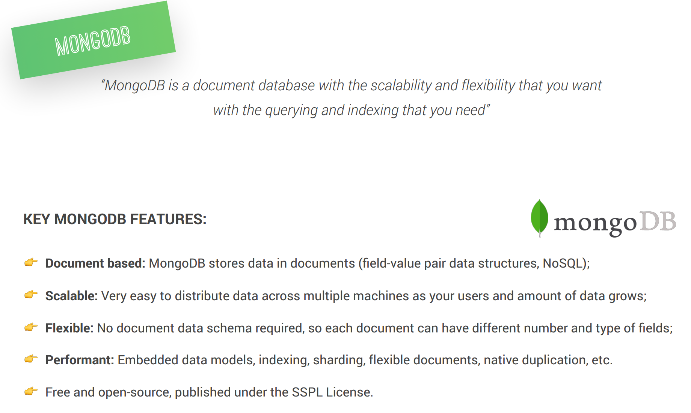
  - 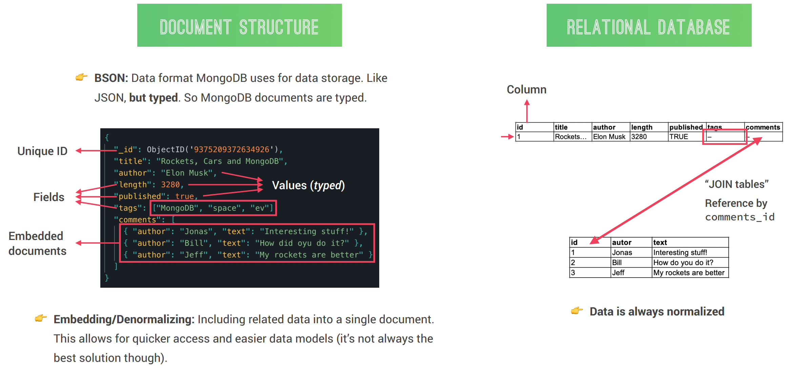
  - Use `Mongo Shell`

    - Use command `mongo` to start mongo database server locally and have access to mongo Shell
    - In mongo shell, the data that we create is always document so we have to create that document inside a collection by specifying the collection before inserting a new document.

    ```
    > use natours-test
    switched to db natours-test
    > db.tours.insertOne({ name: "The Forest Hiker", price: 297, rating: 4.7 })
    {
      "acknowledged" : true,
      "insertedId" : ObjectId("5e99de416d049382d16d513a")
    }
    > show collections
    tours
    > db.tours.find()
    { "_id" : ObjectId("5e99de416d049382d16d513a"), "name" : "The Forest Hiker", "price" : 297, "rating" : 4.7 }
    > quit()
    ```

    - `use natours-test` will create a new database `natours-test` if it doesn't exist in mongo server and then switch from the current db to db `natours-test`
    - `db` refers to the current db we're in
    - `db.tours.insertOne(...)` will create a new `tours` collection if it's not already existed, then insert the new document in.
    - The parameter of `insertOne` can be a JavaScript Object

    - CRUD:
      - Create: `insertOne` or `insertMany`
        ```
        > db.tours.insertMany([{ name: "The Sea Explorer", price: 497, rating: 4.8 }, { name: "The Snow Adventurer", price: 997, rating: 4.9, difficulty: "easy" }])
        {
          "acknowledged" : true,
          "insertedIds" : [
            ObjectId("5e99ec436d049382d16d513b"),
            ObjectId("5e99ec436d049382d16d513c")
          ]
        }
        ```
      - Read: `find()` or `find({ search criteria })`. Search criteria examples:
        - `{ name: "The Forest Hiker" }` or `{ difficulty: "easy" }`
        - `{ price: {$lte: 500} }`
        - `{ price: {$lt: 500}, rating: {$gte: 4.8} }`
        - `{ $or: [ {price: {$lt: 500}}, {rating: {$gte: 4.8}} ] }`
        - Projection: `db.tours.find({ $or: [ {price: {$gt: 500}}, {rating: {$gte: 4.8}} ] }, {name: 1})`
        ```
        > db.tours.find()
        { "_id" : ObjectId("5e99de416d049382d16d513a"), "name" : "The Forest Hiker", "price" : 297, "rating" : 4.7 }
        { "_id" : ObjectId("5e99ec436d049382d16d513b"), "name" : "The Sea Explorer", "price" : 497, "rating" : 4.8 }
        { "_id" : ObjectId("5e99ec436d049382d16d513c"), "name" : "The Snow Adventurer", "price" : 997, "rating" : 4.9, "difficulty" : "easy" }
        > db.tours.find({ name: "The Forest Hiker" })
        { "_id" : ObjectId("5e99de416d049382d16d513a"), "name" : "The Forest Hiker", "price" : 297, "rating" : 4.7 }
        > db.tours.find({ price: {$lte: 500} })
        { "_id" : ObjectId("5e99de416d049382d16d513a"), "name" : "The Forest Hiker", "price" : 297, "rating" : 4.7 }
        { "_id" : ObjectId("5e99ec436d049382d16d513b"), "name" : "The Sea Explorer", "price" : 497, "rating" : 4.8 }
        > db.tours.find({ $or: [ {price: {$gt: 500}}, {rating: {$gte: 4.8}} ] }, {name: 1})
        { "_id" : ObjectId("5e99ec436d049382d16d513b"), "name" : "The Sea Explorer" }
        { "_id" : ObjectId("5e99ec436d049382d16d513c"), "name" : "The Snow Adventurer" }
        ```
      - Update: `updateOne` or `updateMany`
        ```
        > db.tours.updateOne({ name: "The Snow Adventurer" }, { $set: {price: 597} })
        { "acknowledged" : true, "matchedCount" : 1, "modifiedCount" : 1 }
        > db.tours.updateMany({ price: {$gt: 500}, rating: {$gte: 4.8} }, { $set: {premium: true} } )
        { "acknowledged" : true, "matchedCount" : 1, "modifiedCount" : 1 }
        ```
        - `updateOne` or `updateMany` requires 2 objects. First obj is similar to what we pass to `find()` in order to find the document that we want to make changes to. Second obj is the properties that we want to be updated to `price` or newly created `premium`.
        - This second object has to include `$set` operator.
        - If there are multiple documents that matches the object the `updateOne` will only make changes to the first document. So if we know there are multiple matches, we should use `updateMany` to make sure the change will be applied to all.
      - Delete: `deleteOne`, `deleteMany`
        ```
        > db.tours.deleteMany({ rating: {$lt: 4.8} })
        { "acknowledged" : true, "deletedCount" : 1 }
        > db.tours.deleteMany({}) --> to delete ALL documents
        ```

  - Use MongoDB Compass

    - 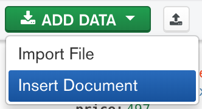 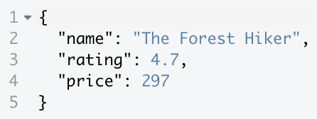
    - 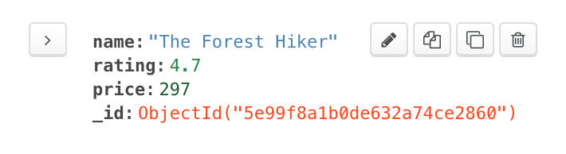
    - 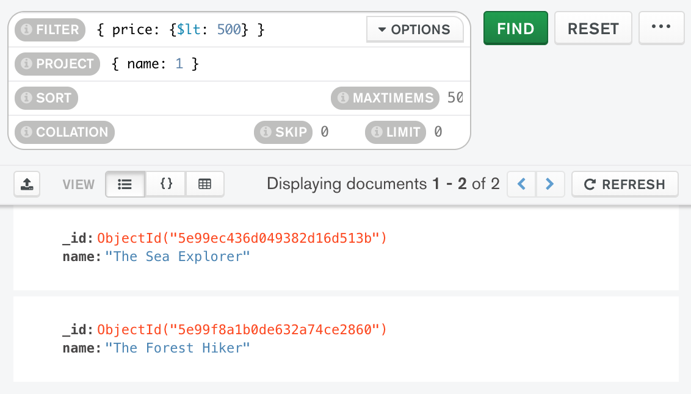

  - Use `Atlas` - Remote MongoDB Database Server

    - The MongoDB database server created by `mongo` in terminal is a local server. `Atlas` is a db server on the cloud.
    - Create a free account on `Atlas` website
    - Create a new project => new cluster
    - 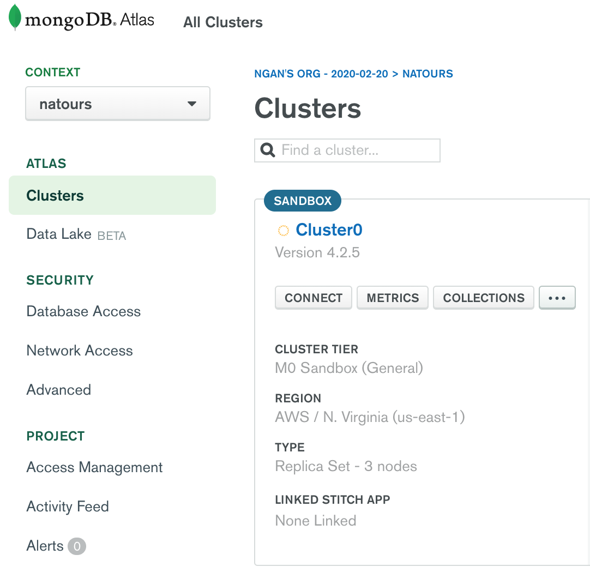
    - Connect the remote database on `Atlas` with the Compass app and Mongo Shell on our computer
      - In the `Cluster0`'s sandbox, click `CONNECT` button. Add your IP address to be whitelisted. Create a username and password to connect to this cloud natours db.
      - 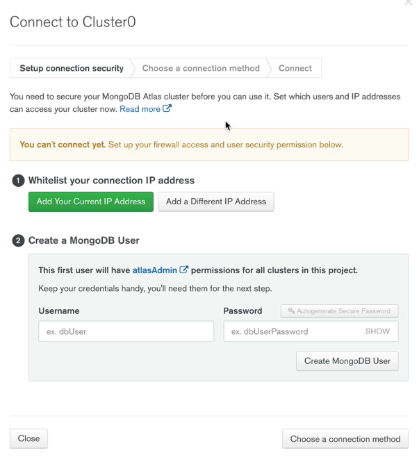 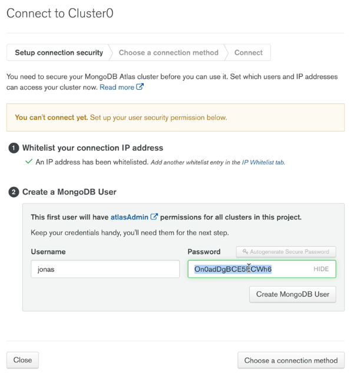
      - 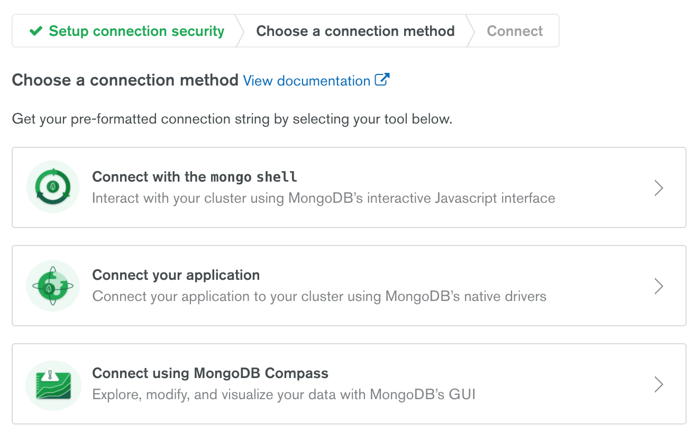
      - In the next step, choose to connect to MongoBD Compass -> I have MongoDB Compass -> Copy the connection string
      - 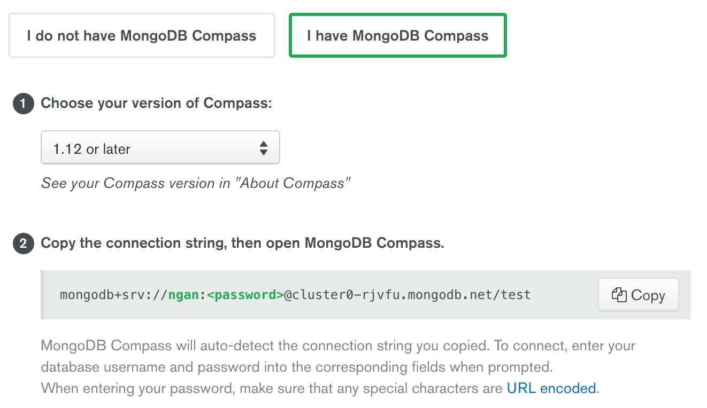
      - Open MongoDB Compass, on the toolbar, click connect -> connect to. The information in the above string will be automatically added to the form, add the password you created before, then click Connect.
      - 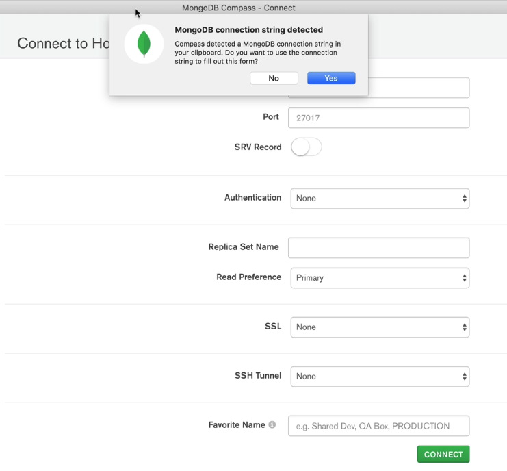
      - Once it is connected to your MongoDB Compass, create a new DB
      - 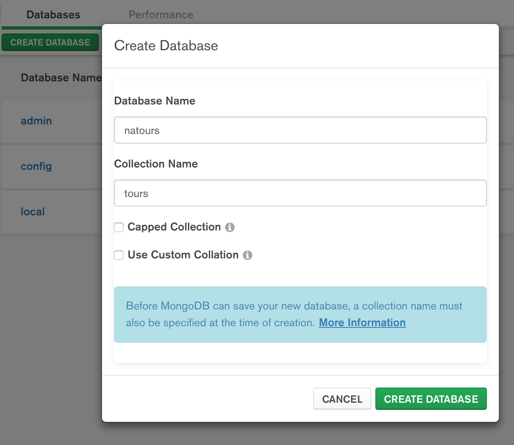
      - After finishing connect MongoDB Compass with the remote DB, we want to connect Mongo Shell with the remote DB too. Go back to Atlas Natours' cluster, click Connect, and then choose to connect to MongoDB Shell. Then copy the connection string and run it in the terminal. When being asked for password, use that same password in the step above.
      - 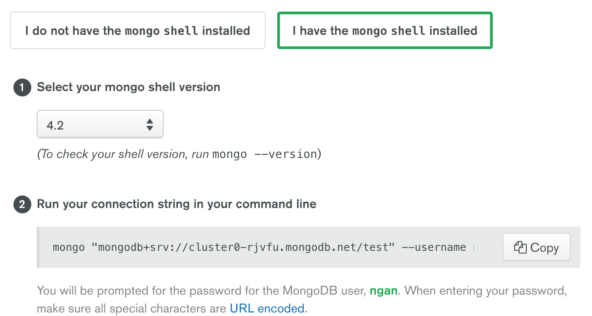

  - Connect MongoBD to Node.js Application

    - Connect with local Mongo DB server. Make sure to keep the MongoDB shell running. Use this connection string in `config.env`
      ```
      DATABASE_LOCAL=mongodb://localhost:27017/natours
      ```
    - Connect with remote DB `Atlas`
      - Similar to the steps above, now we choose the option `Connect Your Application` to get the connection string. Remember to choose `Node.js` in the `DRIVER` box
      - 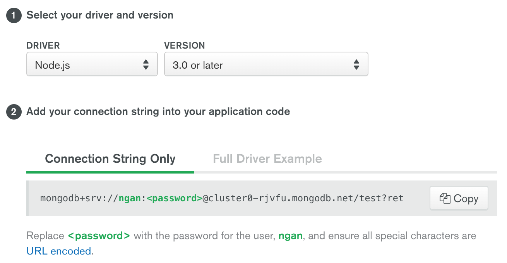
      - Go to `config.env` file in Natours folder and paste the string like this
        ```
        DATABASE=mongodb+srv://ngan:<password>@cluster0-rjvfu.mongodb.net/test?retryWrites=true&w=majority
        ```
      - The `<password>` part is where we will put our real password in => change it to uppercase to make it easier to see
      - `test` in this string is the `test` database that's being created by Mongo Atlas when we first created the Project. But we don't want to use `test`, we want to use our Natours db. So we need to replace that
        ```
        DATABASE=mongodb+srv://ngan:<PASSWORD>@cluster0-rjvfu.mongodb.net/natours?retryWrites=true&w=majority
        ```
    - Use MongoDB in the Node.js Application: We need to install a MongoDB driver for Node.js, for example `Mongoose`. It is a software that allows Node.js code to access and interact with a MongoDB db.

      - Install Mongoose `npm i mongoose@5`
      - Configure `Mongoose` in `server.js`

        ```js
        const mongoose = require('mongoose');
        const dotenv = require('dotenv');

        dotenv.config({ path: './config.env' });

        const DB = process.env.DATABASE.replace(
          '<PASSWORD>',
          process.env.DATABASE_PASSWORD
        );

        mongoose
          .connect(DB, {
            useNewUrlParser: true,
            useCreateIndex: true,
            useFindAndModify: false,
            useUnifiedTopology: true,
          })
          .then((con) => console.log('DB connection successful'));
        ```

  - ### Mongoose

    - 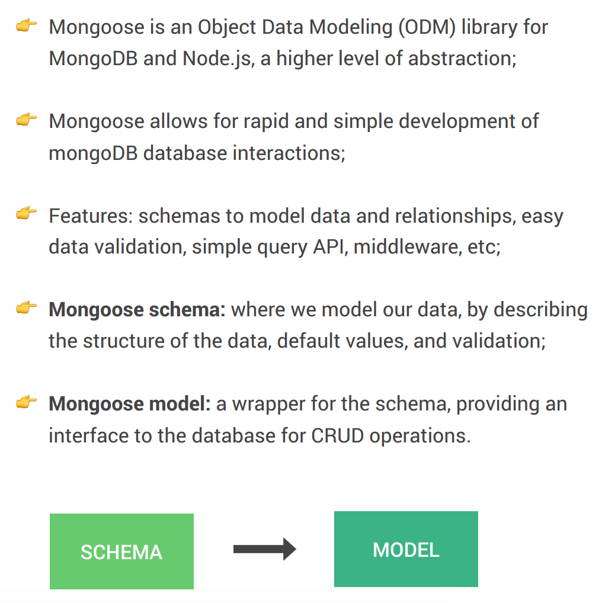
    - Mongoose is a layer of abstraction over the regular MongoDB Driver.
    - An Object Data Modeling (ODM) library is a way for us to write JavaScript code that interacts with database
    - Mongoose is all about model. Model is like a blueprint used to create documents (comparable to Classes in JS). Model is also used to do CRUD operations. To create a model, we need a Schema. Schema is used to describe the model, set default value, validate data, etc.
    - Step 1: Create a schema:
      - Basic Schema: use `mongoose.Schema` to specify a schema for the data
        ```js
        const tourSchema = new mongoose.Schema({
          name: String,
          rating: Number,
          price: Number,
        });
        ```
      - Schema with Schema Type Option. With Schema Type Option, we can define different options with validation for a field (called validator). Different Types have different options as well.
        ```js
        const tourSchema = new mongoose.Schema({
          name: {
            type: String,
            required: [true, 'A tour must have a name'],
            unique: true,
          },
          rating: {
            type: Number,
            default: 4.5,
          },
          price: {
            type: Number,
            required: [true, 'A tour must have a price'],
          },
        });
        ```
    - Step 2: Create a model using a defined Schema. This model will then be a `collection` in the database
      ```js
      const Tour = mongoose.model('Tour', tourSchema);
      ```
    - Step 3: Create Documents from our Model. This will be a document of the Model collection. Mongoose allows us to use JavaScript to create an instance of a Tour model similar to JS classes. Since the doc is an instance of a class, it has access to some methods as well. For example, `doc.save()` will save the newly created document to its Model collection in db. `doc.save()` returns a Promise.
      ```js
      const testTour = new Tour({
        name: 'The Forest Hiker',
        rating: 4.7,
        price: 497,
      });
      testTour
        .save()
        .then((doc) => console.log(doc))
        .catch((err) => console.log('ERROR: ', err));
      ```
      - We can also use `Tour.create({})` then pass in the data as above as parameter. This will create and save new doc to the Tour collection, then return a Promise
    - <a href="#">Updating APIs CRUD operations with `Atlas MongoDB` using `Mongoose` driver</a>

      - Removed several middleware like param middleware to check for ID, and middleware to check the body of a POST request because those are not nessessary anymore. By using `Mongoose` and its Model, we'll be catching for err from Model's functions.
      - Note: if the body of POST request to create new tour contains for fields than the Schema, mongoose will ignore those extra fields.

      ```js
      const Tour = require('./../models/tourModel');

      exports.createTour = async (req, res) => {
        try {
          const newTour = await Tour.create(req.body);
          res.status(201).json({
            status: 'success',
            data: { tour: newTour },
          });
        } catch (err) {
          res.status(400).json({
            status: 'fail',
            message: 'Invalid data sent',
          });
        }
      };

      const tours = await Tour.find(); // converts the result into JS object
      const tour = await Tour.findById(req.params.id); // ~ Tour.findOne({ _id: req.params.id })
      const updatedTour = await Tour.findByIdAndUpdate(
        req.params.id,
        req.body,
        {
          new: true,
          runValidators: true,
        }
      );
      await Tour.findByIdAndDelete(req.params.id);
      ```

  - ### Model-View-ConTroller: MVC Back-End Architecture

    - `MODEL` layer - Concerns everything related to application data and business logic
    - `CONTROLLER` layer - Application Logic - Functions of the Controller is to handle application requests, interact with MODEL and send back responses to the clients
    - `VIEW` layer - Presentation logic - neccessary if we have a graphical interface in our app (in other words, if we build a server-side rendering website). VIEW layer consists of the templates used to generate the view/website that will be sent back to the clients
    - Using this architecture allows us to write a more modular application, which makes it easier to maintain in scale
    - The goal of the `ROUTER` is to delegate the request to the right function in of the controllers
    - 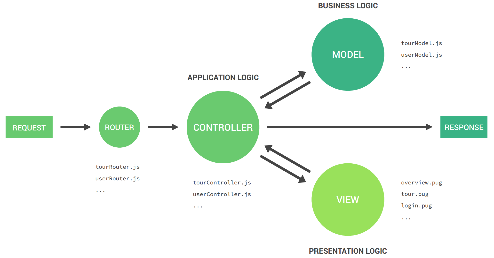

    - We want to separate application logic and business logic
    - 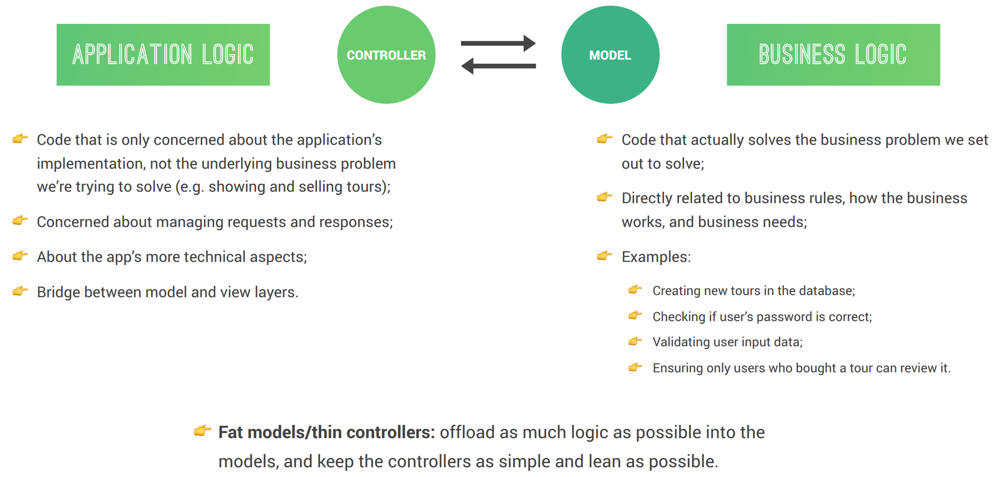
    - <a href="https://github.com/ngannguyen117/Node.js-Bootcamp/commit/f905bb2141a99dab65b9f4e60f240cc68d4b06c2">Commit Link</a>
