# Table Of Content

- **[Environment Variables](#environment-variables)**
- **[APIs and RESTful API Design](#apis-and-restful-api-design)**
- **[Setting up ESLint + Prettier in VS Code](#setting-up-eslint--prettier-in-vs-code)**
- **[Model-View-Controller: MVC Back-End Architecture](#model-view-controller-mvc-back-end-architecture)**
- **[Debugging Node.js with ndb](#debugging-nodejs-with-ndb)**
- **[Unhandled Rejections and Uncaught Exception](#unhandled-rejections-and-uncaught-exception)**
- **[Express](#express)**
  - [Basic Routing](#basic-routing-with-express)
  - [Simple GET, POST, PATCH, DELETE Requests at Endpoint /api/v1/tours](#simple-get-post-patch-delete-requests-at-endpoint-apiv1tours)
  - [Refactoring Routes](#refactoring-routes)
  - [Middleware and the Request-Response Cycle](#middleware-and-the-request-response-cycle)
  - [Creating and Mounting Multiple Routers](#creating-and-mounting-multiple-routers)
  - [Restructuring Files](#restructuring-files)
  - [Param Middleware](#param-middleware)
  - [Serving Static Files by middleware express.static](#serving-static-files-by-middleware-expressstatic)
  - [Handling Unhandled Routes](#handling-unhandled-routes)
  - [Error Handling](#error-handling)
- **[MongoDB](#mongodb)**
  - [CRUD Operations](#crud-operations)
  - [Use Mongo Shell](#use-mongo-shell)
  - [Use MongoDB Compass](#use-mongodb-compass)
  - [Use Atlas - Remote MongoDB Database Server](#use-atlas---remote-mongodb-database-server)
  - [Connect MongoDB to Node.js Application](#connect-mongodb-to-nodejs-application)
  - [Use MongoDB in the Node.js Application](#use-mongodb-in-the-nodejs-application)
- **[Mongoose](#mongoose)**
  - [Schema](#step-1-create-a-schema)
    - [Virtual Properties](#virtual-properties)
    - [Middleware in Mongoose](#middleware-in-mongoose)
    - [Data Validation](#data-validation)
  - [Create Model from Schema](#step-2-create-a-model-using-a-defined-schema)
  - [Create Documents from Model](#step-3-create-documents-from-our-model)
  - [Update APIs CRUD Operations with MongoDB Database](#updating-apis-crud-operations-with-atlas-mongodb-using-mongoose-driver)
  - [Aggregation Pipeline](#mongodb-aggregation-pipeline-using-mongoose)
- **[Advanced Mongoose](#advanced-mongoose)**
  - [Data Modelling](#data-modelling)
  - [Design Natours Data Model](#design-natours-data-model)
  - [Indexes](#indexes)
  - [Calculate Average Rating on Tours](#calculate-average-rating-on-tours)
  - [Geospatial](#geospatial)
- **[API Features](#api-features)**
  - [Filtering](#filtering)
  - [Sorting](#sorting)
  - [Limiting Fields](#limiting-fields)
  - [Pagination](#pagination)
  - [Aliasing](#aliasing)
- **[Authentication, Authorization and Security](#authentication-authorization-and-security)**
  - [Security Best Practices](#security-best-practices)
  - [Create new users and manage passwords](#create-new-users-and-manage-passwords)
  - [How Authentication with JWT works](#how-authentication-with-jwt-works)
  - [Sending JWT via Cookie](#sending-jwt-via-cookie)
  - [Rate Limiting](#rate-limiting)
  - [Security HTTP Headers](#security-http-headers)
  - [Data Sanitization](#data-sanitization)
  - [Preventing Parameter Pollution](#preventing-parameter-pollution)
- **[Server-Side Rendering](#server-side-rendering-with-pug-templates)**
  - [Pug: Template Engine to Render Website](#pug-template-engine-to-render-website)
  - [Include a map in Tour Detail Page with Mapbox](#include-a-map-in-tour-detail-page-with-mapbox)
  - [Log in Users with API](#log-in-users-with-api)
  - [Logging out users](#logging-out-users)
  - [Update User Data directly from HTML form](#update-user-data-directly-from-html-form)
- **[Advanced Features: Payments, Email, File Uploads](#advanced-features-payments-email-file-uploads)**

# Environment Variables

- `Node.js` app can run in different environment such as development environment or production environment.
- Depending on which environment it's running on, we can have different setting like turning on/off debugging/logging, using different databases, etc. These settings are setup in the environment variables.
- By default, `express` sets the environment to development
- We can check which environment the express app is running on by `app.get('env')`. This `env` variable is set by express
- Node.js also set many environment variables at `process.env`. The `process` module comes from CORE modules. It's available to all module and we don't need to require it.
- In express, many packages depends on the environment variable called `NODE_ENV`, which defines whether we're in development or production mode, but express do not define this variable so we have to do that manually. Set environment variable using:

  -Command line or a script in package.json: `NODE_ENV=development nodemon server.js` or

  -Write a `config.env` file:

  ```
  NODE_ENV=development
  PORT=8000
  USER=ngan
  PASSWORD=123456
  ```

  For Node.js to access those environment variables in `config.env`, we use a 3rd party package call `dotenv` `npm i dotenv`. After running `dotenv.config({ path: './config.env' });` in `server.js`, `process.env` now will include all variables above

- <a href="https://github.com/ngannguyen117/Node.js-Bootcamp/commit/920d8f075b63fecf933b8fc6d0583d18d0d7e2e0">Commit Link</a>

# [APIs and RESTful API Design](https://github.com/ngannguyen117/Node.js-Bootcamp/commit/897f1a90b031a3587644b7cbd3e1f43446e4625b)

- API: Application Programming Interface - A piece of software used by another piece of software to allow applications to talk to each other. APIs aren't only used to send data and not always related to web development. `Application` can mean many other things as long as the piece of software relatively stands alone. For example: `fs`, `http` modules in Node.js are APIs <= Node APIs, Browser's DOM JS API, etc.
- The REST Architecture: REpresentational State Transfer - a way of building web APIs in a logical way making them easy to consume

  

  

  

  

# Setting up ESLint + Prettier in VS Code

Install these development dependency and then add rules to `.eslintrc.json`

```
npm i eslint prettier eslint-config-prettier eslint-plugin-prettier eslint-config-airbnb eslint-plugin-node eslint-plugin-import eslint-plugin-jsx-a11y eslint-plugin-react --save-dev
```

# Model-View-Controller: MVC Back-End Architecture

- `MODEL` layer - Concerns everything related to application data and business logic
- `CONTROLLER` layer - Application Logic - Functions of the Controller is to handle application requests, interact with MODEL and send back responses to the clients
- `VIEW` layer - Presentation logic - neccessary if we have a graphical interface in our app (in other words, if we build a server-side rendering website). VIEW layer consists of the templates used to generate the view/website that will be sent back to the clients
- Using this architecture allows us to write a more modular application, which makes it easier to maintain in scale
- The goal of the `ROUTER` is to delegate the request to the right function in of the controllers

  

- We want to separate application logic and business logic as much as possible

  

- <a href="https://github.com/ngannguyen117/Node.js-Bootcamp/commit/f905bb2141a99dab65b9f4e60f240cc68d4b06c2">Commit Link</a>

# Debugging Node.js with ndb

Install `ndb` globally: `npm i global ndb`

Write a script in package.json: `"debug": "ndb server.js"`

Start debugging by this command in terminal: `npm run debug`

In `ndb`, set a breakpoint by clicking on the line number, then run the app by sending a request, for example. Once the code hit the breakpoint, it will resume `ndb` at that breakpoint with the current local and global data info on the right


If we set a breakpoint in the `server.js` like in the screenshot, we will be able to see the middleware stack of the `router` (under `app`)

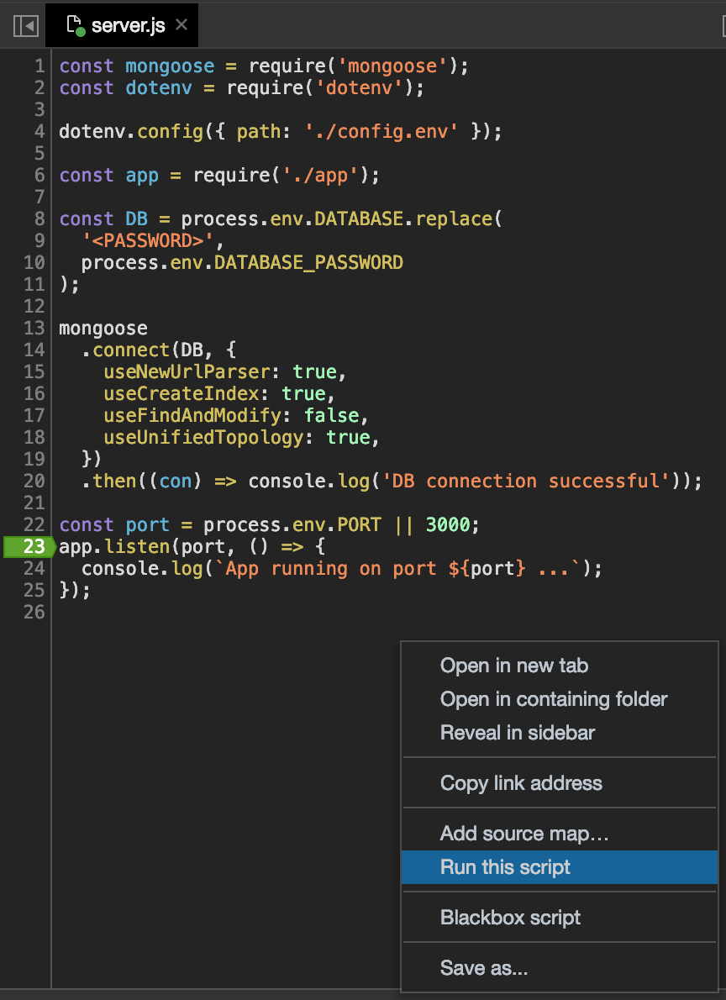

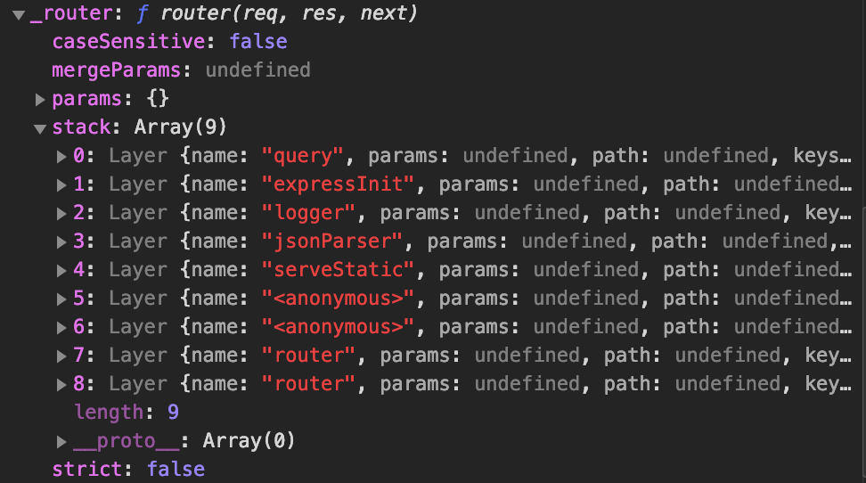

# Unhandled Rejections and Uncaught Exception

It is recommended to handle Rejections and Exception close to where the code is at. However, we should also have a global handler in case we miss handling any.

Below is a simple way to handle those. In production, the service hosts the nodejs application would then have a tool in place to restart the server.

- ### [Error Outside Express: Unhandled Rejections](https://github.com/ngannguyen117/Node.js-Bootcamp/commit/de8f715b28c3e31326fe9afaab0bfe05f2429593)

  So far we've handled errors coming from Express application, async functions in controllers and querying database by letting a global error handler in express handle it. However, we haven't handle errors outside of Express such as problems with database connection (this is in `server.js`) like the db is down or we cannot log in.

  If we change the db password and then try to connect to the db, we'll receive an `Unhandled Promise Rejection`, which means somewhere in our code, there's a promise that got rejected but that rejection is not handled anywhere.

  When there's a Rejection somewhere in our application, the `process` object will emit an Object called `unhandledRejection` so we can subscribe to that event

  ```js
  // in server.js, gracefully shut down the server
  process.on('unhandledRejection', (err) => {
    console.log('UNHANDLED REJECTION');
    console.log(err.name, err.message);
    server.close(() => process.exit(1)); // 0 for success, 1 is for unhandled rejection);
  });
  ```

- ### [Uncaught Exceptions](https://github.com/ngannguyen117/Node.js-Bootcamp/commit/f911b3cc15d2ece3a2879afa0c55eebf3f7d77bc)

  In Uncaught Exceptions, we have to shut down the server because the code right now is not clean. And then restart the server. We also need to put this handler at the beginning of `server.js` before any code runs so that if there's any problem, it can catch it.

  ```js
  process.on('uncaughtException', (err) => {
    console.log('UNCAUGHT EXCEPTION');
    console.log(err.name, err.message);
    process.exit(1);
  });
  ```

# EXPRESS


-Install with npm: `npm i express@4`

-It is a convention to have all express configuration in `app.js`

## [Basic Routing with Express](https://github.com/ngannguyen117/Node.js-Bootcamp/commit/59e1b0bbefa2476c59b13403f30b1b210c23055d):

-`express` is a function that upon calling will add a bunch of methods to the `app` variable

```js
const express = require('express');
const app = express();
app.listen(3000, () => {}); // To start up a server at port #3000
```

-We need to define routes. Routing means how the application responds to the client's requests (certain urls & HTTP methods used for that request)

-`get`: HTTP GET method, `'/'`: Endpoint/URL, the rest is the callback function (called `route handler`) with request and response object parameters. `.json` automatically sets the `Content-Type: application/json` while `.send` only sends text.

```js
app.get('/', (req, res) => {
  res
    .status(200)
    .json({ message: 'Hello from the server side', app: 'Natours' });
});
```

## Simple <a href="https://github.com/ngannguyen117/Node.js-Bootcamp/commit/66c91c7012151a95f8040e6ed36264b64252c2c4">GET</a>, <a href="https://github.com/ngannguyen117/Node.js-Bootcamp/commit/c0055573f21d10942147c1f4b4423b27d72d6c68">POST</a>, <a href="https://github.com/ngannguyen117/Node.js-Bootcamp/commit/d2c3a1ccc827bc1e96a987a7a2de7d91c8ad167b">PATCH</a>, <a href="https://github.com/ngannguyen117/Node.js-Bootcamp/commit/8caf015c45bb4644827188eb5544e3029ba492aa">DELETE</a> Requests at Endpoint `/api/v1/tours`

```js
app.use(express.json());

const tours = JSON.parse(
  fs.readFileSync(`${__dirname}/dev-data/data/tours-simple.json`)
);

app.get('/api/v1/tours', (req, res) => {
  res.status(200).json({
    status: 'success',
    results: tours.length,
    data: { tours },
  });
});

app.post('/api/v1/tours', (req, res) => {
  const newID = tours[tours.length - 1].id + 1;
  const newTour = Object.assign({ id: newID }, req.body);
  tours.push(newTour);
  fs.writeFile(
    `${__dirname}/dev-data/data/tours-simple.json`,
    JSON.stringify(tours),
    (err) => {
      res.status(201).json({
        status: 'success',
        data: { tour: newTour },
      });
    }
  );
});
```

- In the `POST` request `req` parameter, out of the box, `express` doesn't have access to the body of the POST request so we need to use middleware `app.use(express.json())`. Middleware is a function that can modify the incoming request data. It's called middleware because it stands between the request and response. `express.json()` is the middleware that helps express app to access the request body and that data is added to the request object.

  

- <a href="https://github.com/ngannguyen117/Node.js-Bootcamp/commit/7ff03a8df314a53afc5a3ee7703167790b79bd6e">Accessing to URL Parameters</a>.

  - In the below example, we added `/:id` to the endpoint because we want to get the tour with id = 14 with this endpoint `/api/v1/tours/14`.
  - The value of `req.params` would be something like `{ id: '14' }`.
  - If there are more parameters, we can add more like `/:id/:x/:y` => `{ id: '14', x: '1', y: '2' }`, if we want to make one of the parameters optional, we can add `?` like `/:id/:x/:y?` => `{ id: '14', x: '1', y: undefined }`

  ```js
  app.get('/api/v1/tours/:id', (req, res) => {
    const id = req.params.id * 1;
    if (id > tours.length) {
      return res.status(404).json({
        status: 'fail',
        message: 'Invalid ID',
      });
    }
    const tour = tours.find((element) => element.id == id);
    res.status(200).json({
      status: 'success',
      data: { tour },
    });
  });
  ```

## <a href="https://github.com/ngannguyen117/Node.js-Bootcamp/commit/0d76673339f0bb7b8cd63a49fe7d3580d7750ab3">Refactoring Routes</a>

To make the routes/endpoints clearer, we create separate functions for the request handlers and then pass them into respective HTTP methods. Additionally, we can use `.route(...)` of express app to show which methods we use for different routes.

```js
app.route('/api/v1/tours').get(getAllTours).post(createTour);

app
  .route('/api/v1/tours/:id')
  .get(getTour)
  .patch(updateTour)
  .delete(deleteTour);
```

## <a href="https://github.com/ngannguyen117/Node.js-Bootcamp/commit/3d1384845708948070c63ed0299bdfc07f823f38">Middleware and the Request-Response Cycle</a>

  

- To apply a middleware to express app, we use `app.use` and pass a middleware handler in.
- We can write our own middleware handler:

  This handler/function has three parameters: request, response, and next. `next` is the next middleware. At the end of each handler, we always have to call `next()`, otherwise it will get stuck at the current middleware. The middleware in `app.use` will be applied to all requests below it

  Example of a global middleware

  ```js
  app.use((req, res, next) => {
    req.requestTime = new Date().toISOString();
    next();
  });
  ```

- Or use a 3rd-Party middleware.

  Ex: `morgan` (`npm i morgan`)

  => `app.use(morgan('dev'));`

  => `GET /api/v1/tours 200 6.250 ms - 8681` - is printed in terminal

## <a href="https://github.com/ngannguyen117/Node.js-Bootcamp/commit/3f84f36712f362f1c98bf6f9f0eabe793c9b6f49">Creating and Mounting Multiple Routers</a>

According to the RESTful architecture, each resource like tours or users should be an endpoint. So we'd want to create a route for each of the resources and put them in a separate file to make it easier to manage when the app gets bigger.

To make each resource a route, we use middleware `express.Router()`. Each of the resource now becomes a mini app having its own root

Once the request match the endpoint declared in `app.use(...)`, it will run the attached Router

```js
const tourRouter = express.Router();

tourRouter.route('/').get(getAllTours).post(createTour);
tourRouter.route('/:id').get(getTour).patch(updateTour).delete(deleteTour);

app.use('/api/v1/tours', tourRouter);
```

## <a href="https://github.com/ngannguyen117/Node.js-Bootcamp/commit/5ea2bd0e695bbb50b3a4eb81c81dc3205502cecc">Restructuring Files</a>

- `server.js`: the starting file of this web app. This is where we starts the server and will include everything related to the server
- `app.js`: will only include code related to express and global express middleware
- 2 new folders created:
  - `routes`: to hold all the resources routers
  - `controllers`: to hold each router's handlers
- We written an NPM script `"start": "nodemon server.js"` in `package.json` to start the Node.js app

## <a href="https://github.com/ngannguyen117/Node.js-Bootcamp/commit/ffa6a4e674bd6bf3633fee1e1a325ded0ec5c37c">Param Middleware</a>

-`router.param(parameterName, handler)` is a middleware that will run the handler if the request url has a param that matches the provided parameterName.

-The signature of the handler function being passed to a param middleware:

```js
(req, res, next, val) => {
  console.log(`The param value is ${val}`);
  next();
};
```

-In this commit, we created a `checkID` param handler in `tourController` to validate ID before calling the final handler. This `checkID` function is then called in `tourRoutes`'s `router.param`

## <a href="https://github.com/ngannguyen117/Node.js-Bootcamp/commit/db5127b5027474ad2d19c4cf253ff59f624cab50">Serving Static Files by middleware `express.static`</a>

-Static files are files in the file system that cannot be accessed using routes like the `overview.html` or images in the `public` folder.

-For example, if we try to access `http://127.0.0.1:3000/public/overview.html` we will get an error because we didn't define any routes for that link

-In order to access static files, we need to use middleware

```
app.use(express.static(`${__dirname}/public`));
```

- We want to serve all files in the `public` folder => `public` folder becomes the root folder of the app.
- To access `overview.html` we have to remove public from the previous URL `http://127.0.0.1:3000/overview.html` because when express app cannot match that URL to any of the defined routes, it will go to the `public` folder to search for the file.
- We can also access to an image in img folder by `http://127.0.0.1:3000/img/pin.png` but we will get an error if we try to access only the `img` folder `http://127.0.0.1:3000/img/` because it's not a file so express app will try to search for a matched route

## [Handling Unhandled Routes](https://github.com/ngannguyen117/Node.js-Bootcamp/commit/8bdb12e094cdb36d91bc7fe05fb70e6004144b9f)

When the clients try to access a route that might not be defined, or they misspell the route, we want to catch all of them and send back a json response

`app.all`: apply this to all HTTP methods

`'*'`: apply to all the routes that we didn't define above this line

```js
app.use('/api/v1/tours', tourRouter);
app.use('/api/v1/users', userRouter);

app.all('*', (req, res, next) => {
  res.status(404).json({
    status: 'fail',
    message: `Can't find ${req.originalUrl} on this server`,
  });
});
```

## ERROR HANDLING

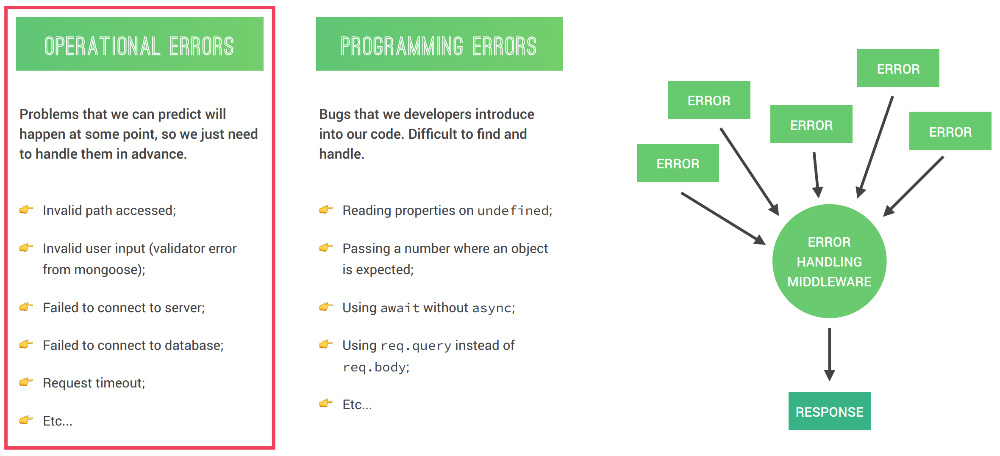

For error handling in `Express`, we focus on Operational Errors. `Express` comes with Error Handling out of the box.

- ### [Global Error Handler](https://github.com/ngannguyen117/Node.js-Bootcamp/commit/83d58acc6e3aace82c47446b62a501223d9f41c4)

  All we have to do is to write a global express error handling middleware which will catch errors from all over the application like from route handlers or model validator, etc. The goal is for errors to end up in one central error handling middleware so we can send a nice response back to the client letting them know what happened.

  Having a global error handling allows a nice separation of concerns so we don't have to worry about handling errors in business logic or controllers or anywhere.

  The error handling functions have 4 parameters, that's how `Express` knows this is an error handler

  ```js
  // Global error handler
  module.exports = (err, req, res, next) => {
    err.statusCode = err.statusCode || 500;
    err.status = err.status || 'error';

    res.status(err.statusCode).json({
      status: err.status,
      message: err.message,
    });
  };
  ```

  Example of applying this global error handler to the response of handling unhandled routes.

  When we pass an argument into the `next` function, `Express` knows that there's an error. `Express` then skips all other middleware and goes straight to the global error handler.

  ```js
  app.all('*', (req, res, next) =>
    next(new AppError(`Can't find ${req.originalUrl} on this server`, 404))
  );

  app.use(globalErrorHandler);
  ```

- ### [Catching Errors in Async Functions](https://github.com/ngannguyen117/Node.js-Bootcamp/commit/237896caf98d435e2c20670b9bbebee741c3e46b)

  Instead of using `try` `catch` block to catch errors from `async/await` function, we wrap the `async` function into another function that will handle the error so that we can remove the `try` `catch` block from the async function. This way, it makes the code more readable and delicate error handling to the global error handler

  ```js
  const catchAsync = (fn) => {
    return (req, res, next) => fn(req, res, next).catch(next);
  };

  exports.createTour = catchAsync(async (req, res, next) => {
    const newTour = await Tour.create(req.body);
    res.status(201).json({
      status: 'success',
      data: { tour: newTour },
    });
  });
  ```

- ### [Errors During Development vs Production](https://github.com/ngannguyen117/Node.js-Bootcamp/commit/c3bcd97c83d2eadaa9332dc0e61516ac8af94c4e)

  In development, we'd want to get detailed errors but in production, we would not want to send long message of errors to the client. Additionally, when sending errors in Production, we want to send different messages to the clients depending on if it's an operational error or not. If it's not, we want to hide the error and only respond with a generic message. Check out the commit for changes in `errorController.js`

- ### [Handle MongoDB Errors](https://github.com/ngannguyen117/Node.js-Bootcamp/commit/ef29ebdc22073e36cf7d73892ae4b652a16e1618)

  Errors that come back from the database doesn't have a statusCode or marked as `isOperational`, so the response sent to the client isn't accurate. That's why when it's a database error (ex: Invalid db IDs, Duplicate Fields, Validation Errors), we need to convert it to our custom `AppError` before sending a response to the clients.

# MongoDB

  

  

  

## CRUD Operations:

- CREATE: `insertOne` or `insertMany`
  ```
  > db.tours.insertMany([{ name: "The Sea Explorer", price: 497, rating: 4.8 }, { name: "The Snow Adventurer", price: 997, rating: 4.9, difficulty: "easy" }])
  {
    "acknowledged" : true,
    "insertedIds" : [
      ObjectId("5e99ec436d049382d16d513b"),
      ObjectId("5e99ec436d049382d16d513c")
    ]
  }
  ```
- READ: `find()` or `find({ search criteria })`. Search criteria examples:

  -`{ name: "The Forest Hiker" }` or `{ difficulty: "easy" }`

  -`{ price: {$lte: 500} }`

  -`{ price: {$lt: 500}, rating: {$gte: 4.8} }`

  -`{ $or: [ {price: {$lt: 500}}, {rating: {$gte: 4.8}} ] }`

  -Projection: `db.tours.find({ $or: [ {price: {$gt: 500}}, {rating: {$gte: 4.8}} ] }, {name: 1})`

  ```
  > db.tours.find()
  { "_id" : ObjectId("5e99de416d049382d16d513a"), "name" : "The Forest Hiker", "price" : 297, "rating" : 4.7 }
  { "_id" : ObjectId("5e99ec436d049382d16d513b"), "name" : "The Sea Explorer", "price" : 497, "rating" : 4.8 }
  { "_id" : ObjectId("5e99ec436d049382d16d513c"), "name" : "The Snow Adventurer", "price" : 997, "rating" : 4.9, "difficulty" : "easy" }
  > db.tours.find({ name: "The Forest Hiker" })
  { "_id" : ObjectId("5e99de416d049382d16d513a"), "name" : "The Forest Hiker", "price" : 297, "rating" : 4.7 }
  > db.tours.find({ price: {$lte: 500} })
  { "_id" : ObjectId("5e99de416d049382d16d513a"), "name" : "The Forest Hiker", "price" : 297, "rating" : 4.7 }
  { "_id" : ObjectId("5e99ec436d049382d16d513b"), "name" : "The Sea Explorer", "price" : 497, "rating" : 4.8 }
  > db.tours.find({ $or: [ {price: {$gt: 500}}, {rating: {$gte: 4.8}} ] }, {name: 1})
  { "_id" : ObjectId("5e99ec436d049382d16d513b"), "name" : "The Sea Explorer" }
  { "_id" : ObjectId("5e99ec436d049382d16d513c"), "name" : "The Snow Adventurer" }
  ```

- UPDATE: `updateOne` or `updateMany`

  ```
  > db.tours.updateOne({ name: "The Snow Adventurer" }, { $set: {price: 597} })
  { "acknowledged" : true, "matchedCount" : 1, "modifiedCount" : 1 }
  > db.tours.updateMany({ price: {$gt: 500}, rating: {$gte: 4.8} }, { $set: {premium: true} } )
  { "acknowledged" : true, "matchedCount" : 1, "modifiedCount" : 1 }
  ```

  - `updateOne` or `updateMany` requires 2 objects. First obj is similar to what we pass to `find()` in order to find the document that we want to make changes to. Second obj is the properties that we want to be updated to `price` or newly created `premium`.
  - This second object has to include `$set` operator.
  - If there are multiple documents that matches the object the `updateOne` will only make changes to the first document. So if we know there are multiple matches, we should use `updateMany` to make sure the change will be applied to all.

- DELETE: `deleteOne`, `deleteMany`

  ```
  > db.tours.deleteMany({ rating: {$lt: 4.8} })
  { "acknowledged" : true, "deletedCount" : 1 }
  > db.tours.deleteMany({}) --> to delete ALL documents
  ```

## Use `Mongo Shell`

Use command `mongo` to start mongo database server locally and have access to mongo Shell

In mongo shell, the data that we create is always document so we have to create that document inside a collection by specifying the collection before inserting a new document.

```
> use natours-test
switched to db natours-test
> db.tours.insertOne({ name: "The Forest Hiker", price: 297, rating: 4.7 })
{
  "acknowledged" : true,
  "insertedId" : ObjectId("5e99de416d049382d16d513a")
}
> show collections
tours
> db.tours.find()
{ "_id" : ObjectId("5e99de416d049382d16d513a"), "name" : "The Forest Hiker", "price" : 297, "rating" : 4.7 }
> quit()
```

- `use natours-test` will create a new database `natours-test` if it doesn't exist in mongo server and then switch from the current db to db `natours-test`
- `db` refers to the current db we're in
- `db.tours.insertOne(...)` will create a new `tours` collection if it's not already existed, then insert the new document in.
- The parameter of `insertOne` can be a JavaScript Object

## Use MongoDB Compass

 


## Use `Atlas` - Remote MongoDB Database Server

-The MongoDB database server created by `mongo` in terminal is a local server. `Atlas` is a db server on the cloud.

-Create a free account on `Atlas` website

-Create a new project => new cluster

  

-Connect the remote database on `Atlas` with the Compass app and Mongo Shell on our computer

- In the `Cluster0`'s sandbox, click `CONNECT` button. Add your IP address to be whitelisted. Create a username and password to connect to this cloud natours db.

   

  

- In the next step, choose to connect to MongoDB Compass -> I have MongoDB Compass -> Copy the connection string

  

- Open MongoDB Compass, on the toolbar, click connect -> connect to. The information in the above string will be automatically added to the form, add the password you created before, then click Connect.

  

- Once it is connected to your MongoDB Compass, create a new DB

  

- After finishing connect MongoDB Compass with the remote DB, we want to connect Mongo Shell with the remote DB too. Go back to Atlas Natours' cluster, click Connect, and then choose to connect to MongoDB Shell. Then copy the connection string and run it in the terminal. When being asked for password, use that same password in the step above.

  

## Connect MongoDB to Node.js Application

- LOCAL MongoDB server

Make sure to keep the MongoDB Shell running. Use this connection string in `config.env`

```
DATABASE_LOCAL=mongodb://localhost:27017/natours
```

- REMOTE DB `Atlas`

  -Similar to the steps above, now we choose the option `Connect Your Application` to get the connection string. Remember to choose `Node.js` in the `DRIVER` box

  

  -Go to `config.env` file in Natours folder and paste the string like this

  ```
  DATABASE=mongodb+srv://ngan:<password>@cluster0-rjvfu.mongodb.net/test?retryWrites=true&w=majority
  ```

  The `<password>` part is where we will put our real password in => change it to uppercase to make it easier to see

  `test` in this string is the `test` database that's being created by Mongo Atlas when we first created the Project. But we don't want to use `test`, we want to use our Natours db. So we need to replace that

  ```
  DATABASE=mongodb+srv://ngan:<PASSWORD>@cluster0-rjvfu.mongodb.net/natours?retryWrites=true&w=majority
  ```

## Use MongoDB in the Node.js Application

We need to install a MongoDB driver for Node.js, for example `Mongoose`. It is a software that allows Node.js code to access and interact with a MongoDB db.

-Install Mongoose `npm i mongoose@5`

-Configure `Mongoose` in `server.js`

```js
const mongoose = require('mongoose');
const dotenv = require('dotenv');

dotenv.config({ path: './config.env' });

const DB = process.env.DATABASE.replace(
  '<PASSWORD>',
  process.env.DATABASE_PASSWORD
);

mongoose
  .connect(DB, {
    useNewUrlParser: true,
    useCreateIndex: true,
    useFindAndModify: false,
    useUnifiedTopology: true,
  })
  .then((con) => console.log('DB connection successful'));
```

# Mongoose

  

-Mongoose is a layer of abstraction over the regular MongoDB Driver.

-An Object Data Modeling (ODM) library is a way for us to write JavaScript code that interacts with database

-Mongoose is all about model. Model is like a blueprint used to create documents (comparable to Classes in JS). Model is also used to do CRUD operations. To create a model, we need a Schema. Schema is used to describe the model, set default value, validate data, etc.

## Step 1: Create a schema:

- Basic Schema: use `mongoose.Schema` to specify a schema for the data

```js
const tourSchema = new mongoose.Schema({
  name: String,
  rating: Number,
  price: Number,
});
```

- Schema with Schema Type Option. With Schema Type Option, we can define different options with validation for a field (called validator). Different Types have different options as well.

```js
const tourSchema = new mongoose.Schema(
  {
    name: {
      type: String,
      required: [true, 'A tour must have a name'],
      unique: true,
    },
    rating: {
      type: Number,
      default: 4.5,
    },
    duration: {
      type: Number,
      required: [true, 'A tour must have a duration'],
    },
  },
  {
    toJSON: { virtuals: true },
    toObject: { virtuals: true },
  }
);
```

- ### [VIRTUAL PROPERTIES](https://github.com/ngannguyen117/Node.js-Bootcamp/commit/6bc87cfb7acac23ca0a0629eacffae949030e24b)

  Fields defined on Schema that are persisted (i.e. won't be saved to the db to save space). Virtual Properties are used for fields that can be derived from one another. For example, we want money in different currency, or distances in miles and km

  The virtual properties will be created each time we get data out of the db, so the `get` function here is the `getter`. Inside this `get` method, we need to use a real function, not arrow function because we need to refer to `this` keyword of the current object.

  We cannot use virtual properties in a query because it doesn't exist in the db.

  ```js
  tourSchema.virtual('durationWeeks').get(function () {
    return this.duration / 7;
  });
  ```

  To make virtual properties to be displayed in a response, we need to pass an option to the Schema:

  ```js
  {
    toJSON: { virtuals: true },
    toObject: { virtuals: true },
  }
  ```

- ### MIDDLEWARE in Mongoose

  Similar to Express, We can use middleware in Mongoose to make something happens in between 2 events. For example, each time a document is saved to the db, we can run a function between the save command and the actual saving of a document or also after the saving event. That's why Mongoose middleware is also called Pre and Post Hooks.

  - [DOCUMENT MIDDLEWARE](https://github.com/ngannguyen117/Node.js-Bootcamp/commit/f486a690ac677938cde198dba5bef6387e4872bb)

    Middleware that can act on the currently processed document. It runs on `Model.Prototype.save()` and `Model.create()` but not `.insertMany()`. We can have multiple middleware for `pre` and `post`

    ```js
    tourSchema.pre('save', function (next) {
      this.slug = slugify(this.name, { lower: true });
      next();
    });

    tourSchema.post('save', function (doc, next) {
      console.log(doc);
      next();
    });
    ```

  - [QUERY MIDDLEWARE](https://github.com/ngannguyen117/Node.js-Bootcamp/commit/8cd4e3024ceaeaaf3e22e9df6065dcac614c3b40)

    Allows us to run some functions before and/or after a certain query is executed. For example, the below code is executed before and after this line of code `const tours = await features.query;`

    `this` refers to the current Query object

    ```js
    tourSchema.pre(/^find/, function (next) {
      this.find({ secretTour: { $ne: true } });
      this.start = Date.now();
      next();
    });

    tourSchema.post(/^find/, function (docs, next) {
      console.log(`Query took ${Date.now() - this.start} milliseconds`);
      console.log(docs);
      next();
    });
    ```

  - [AGGREGATION MIDDLEWARE](https://github.com/ngannguyen117/Node.js-Bootcamp/commit/a6abf69ca39ee1b8bccae37d1c133de29999da8a)

    Allows us to run functions before/after running aggregation pipeline. `this` refers to the Aggregation object

    ```js
    tourSchema.pre('aggregate', function (next) {
      this.pipeline().unshift({ $match: { secretTour: { $ne: true } } });
      console.log(this.pipeline());
      next();
    });
    ```

- ### [DATA VALIDATION](https://github.com/ngannguyen117/Node.js-Bootcamp/commit/07e42ace9ac0a5839d69c40e4861ad91800b8281)

  Checking if the entered value is valid for each field according to the Schema and if all the required fields are included. We do data validation on the Schema because of the Fat Model Thin Controller philosophy.

  - Built-in Validators: such as `required` is a built-in validator for all data types (`unique` is not a validator)

    -`maxlength`, `minlength`: `String` validators to indicate a max/min length this field can have

    -`max`, `min`: `Number` and `Date` validators to indicate a max/min value this field can have => `min: [1, 'Rating must be above 1.0']`

    -`enum`: Available for `String` to indicate which values are allowed for this field

    ```js
    enum: {
      values: ['easy', 'medium', 'difficult'],
      message: 'Difficulty is either: easy, medium, difficult',
    }
    ```

  - Custom Validators: a validator is a function that returns True or False. If it's False, there's a Validation error. `this` will only point to the current document when we create a NEW document, it won't work on an update

    ```js
    priceDiscount: {
      type: Number,
      validate: {
        validator: function (inputValue) {
          return inputValue < this.price;
        },
        message: 'Discount price ({VALUE}) should be below the regular price',
      },
    }
    ```

    We can also use 3rd party validators such as this <a href="https://github.com/validatorjs/validator.js?files=1">String validator</a>

    ```js
    const validator = require('validator');
    // some code
    validate: [validator.isAlpha, 'Tour name must only contain characters'];
    // some more code
    ```

## Step 2: Create a model using a defined Schema.

This model will then be a `collection` in the database

```js
const Tour = mongoose.model('Tour', tourSchema);
```

## Step 3: Create Documents from our Model.

This will be a document of the Model collection. Mongoose allows us to use JavaScript to create an instance of a Tour model similar to JS classes. Since the doc is an instance of a class, it has access to some methods as well. For example, `doc.save()` will save the newly created document to its Model collection in db. `doc.save()` returns a Promise.

```js
const testTour = new Tour({
  name: 'The Forest Hiker',
  rating: 4.7,
  price: 497,
});
testTour
  .save()
  .then((doc) => console.log(doc))
  .catch((err) => console.log('ERROR: ', err));
```

We can also use `Tour.create({})` then pass in the data as above as parameter. This will create and save new doc to the Tour collection, then return a Promise

## [Updating APIs CRUD operations with `Atlas MongoDB` using `Mongoose` driver](https://github.com/ngannguyen117/Node.js-Bootcamp/commit/3782886f4bac35fb055ab614d2cebb12055faacc)

-Removed several middleware like param middleware to check for ID, and middleware to check the body of a POST request because those are not nessessary anymore. By using `Mongoose` and its Model, we'll be catching for err from Model's functions.
-Note: if the body of POST request to create new tour contains for fields than the Schema, mongoose will ignore those extra fields.

```js
const Tour = require('./../models/tourModel');

exports.createTour = async (req, res) => {
  try {
    const newTour = await Tour.create(req.body);
    res.status(201).json({
      status: 'success',
      data: { tour: newTour },
    });
  } catch (err) {
    res.status(400).json({
      status: 'fail',
      message: 'Invalid data sent',
    });
  }
};

const tours = await Tour.find(); // converts the result into JS object
const tour = await Tour.findById(req.params.id); // ~ Tour.findOne({ _id: req.params.id })
const updatedTour = await Tour.findByIdAndUpdate(req.params.id, req.body, {
  new: true,
  runValidators: true,
});
await Tour.findByIdAndDelete(req.params.id);
```

## [MongoDB AGGREGATION PIPELINE Using Mongoose](https://github.com/ngannguyen117/Node.js-Bootcamp/commit/1398044a34b4225690da1a2c369b6fbb296eeee1)

-Refer to these documentations for <a href="https://docs.mongodb.com/manual/reference/operator/aggregation/">Aggregation Pipeline OPERATORS</a> and <a href="https://docs.mongodb.com/manual/reference/operator/aggregation-pipeline/">Aggregation Pipeline STAGES</a>

-MongoDB’s aggregation framework is modeled on the concept of data processing pipelines. Documents enter a multi-stage pipeline that transforms the documents into an aggregated result

  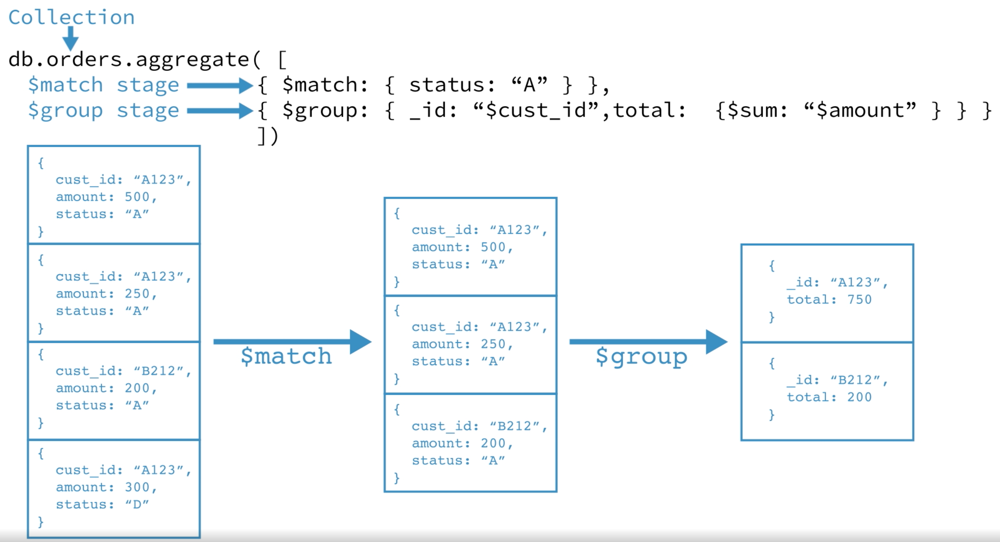

-All except the `$out`, `$merge`, and `$geoNear` stages can appear multiple times in a pipeline

-Example of using Agrregation Pipeline with Mongoose

```js
const stats = await Tour.aggregate([
  {
    $match: { ratingsAverage: { $gte: 4.5 } },
  },
  {
    $group: {
      _id: { $toUpper: '$difficulty' },
      numTours: { $sum: 1 },
      numRatings: { $sum: '$ratingsQuantity' },
      avgRating: { $avg: '$ratingsAverage' },
      avgPrice: { $avg: '$price' },
      minPrice: { $min: '$price' },
      maxPrice: { $max: '$price' },
    },
  },
  {
    $sort: { avgPrice: 1 },
  },
]);
```

-`Tour.aggregate()` takes an array of stages and returns an Aggregation Object. This Aggregation Object is executed when we use `await`

-`$match` stage simply means filtering documents

-`$group` stage: `_id` refers to which field will the result be grouped by, this field will become the new id

-Stages appears after `$group` can only do more operations on the fields declared in the `$group` stage

# ADVANCED MONGOOSE

## Data Modelling

**Data modelling** is a process of taking unprocessed data generated by real-word scenario and then structure it into a logical data model (that reflects real-world relationships between data) in a db based on a set of criteria.

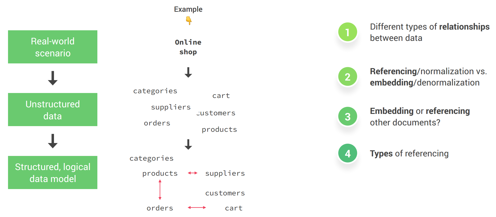

- ### Relationships between data

  `1:1`: 1 field - 1 value. This relationship is not really important in terms of data modelling

  `1:Many`: 1 document can relate to many other documents. This is the most important relationship. In MongoDB, there are 3 types of `1:Many` relationships based on the amount of many: `1:Few`, `1:Many`, `1:Ton`. It is a factor to decide whether to denormalize/normalize data.

  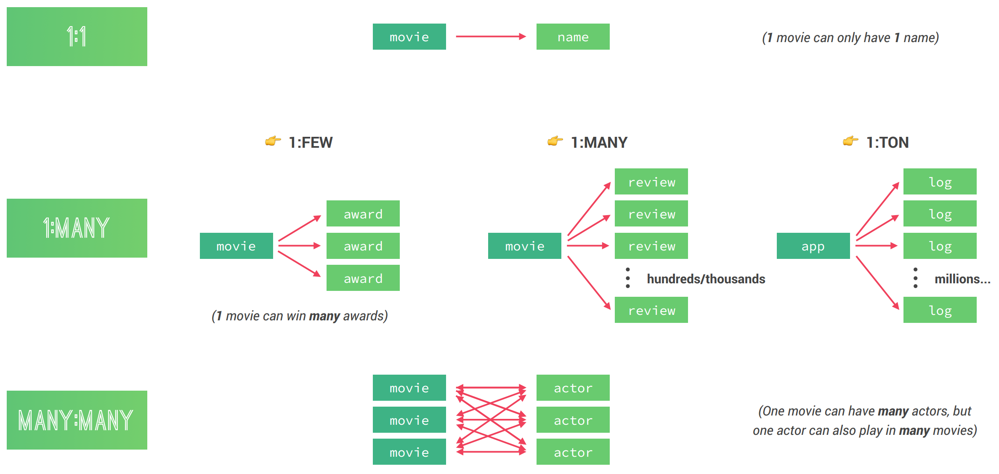

- ### Reference vs Embedding data sets

  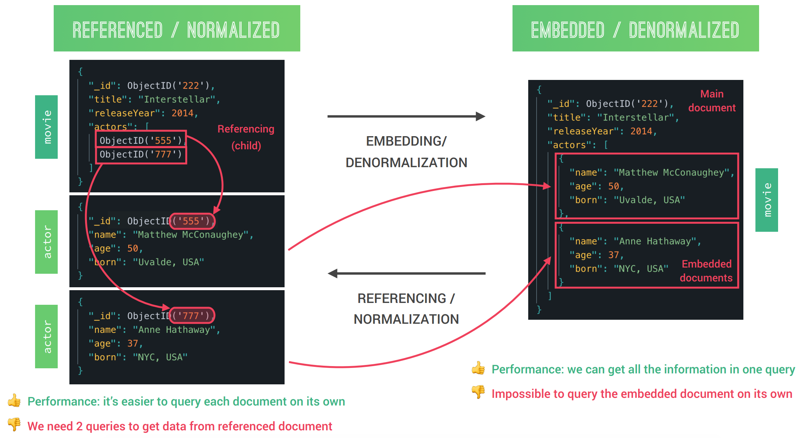

- ### A practical framework for when to embed/reference

  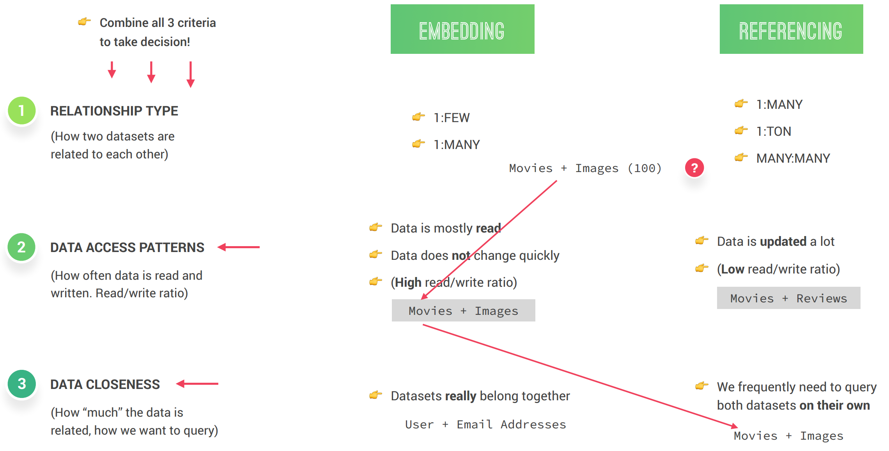

- ### Types of referencing

  

**SUMMARY**

  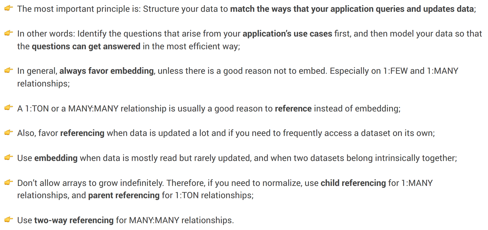

## Design Natours Data Model

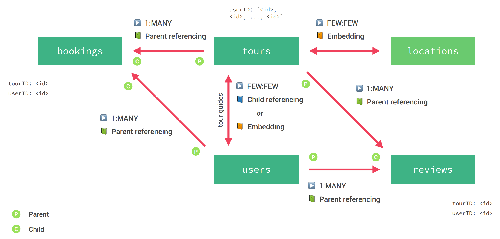

- ### [Modelling LOCATION (Geospartial Data)](https://github.com/ngannguyen117/Node.js-Bootcamp/commit/902cdc51f0d8f974a0e9631205941dae8e14a363)

  **Geospartial Data** describes places on earth using longitude and latitude coordinates. MongoDB support Geospartial data out of the box. MongoBD uses a special data format called `GeoJSON` to specify geospartial data.

  Ex: `startLocation: { GeoJSON }` (tourSchema). The object {} we specify here actually not Schema Type Option. It is an `embedded object` (type GeoJSON representing geospartial data) containing at least 2 fields: type and coordinates. Only inside this object we define the Type Option for each field.

  ```js
  // Part of tourModel.js schema
  startLocation: {
    type: {
      type: String,
      default: 'Point',
      enum: ['Point']
    },
    coordinates: [Number], // [Lat, Long]
    address: String,
  },
  ```

- ### Modelling TOUR GUIDES

  - #### [Embedding](https://github.com/ngannguyen117/Node.js-Bootcamp/commit/dbef51ffc1247020dc48bea6a8519527ea44ad75)

    Embed User documents into Tour documents when creating a new tour. Example of request body for creating new tour with Guide IDs. We have an array of userID for guides

    ```
    {
      "name": "New Test Tour with guides",
      ...
      "guides": ["5ea75c23ed3954a1424baff2", "5ea6f8c267393d02eb2b7e1e"]
    }
    ```

    Then we add a document middleware to run everytime we add a new tour to embed each user doc with matching ID into this Tour doc

    ```js
    tourSchema.pre('save', async function (next) {
      const guidesPromises = this.guides.map(
        async (userID) => await User.findById(userID)
      );
      this.guides = await Promise.all(guidesPromises);
      next();
    });
    ```

    Example of the embedded Tour document:

    ```
    "guides": [
      {
        "role": "guide",
        "_id": "5ea75c23ed3954a1424baff2",
        "name": "Test User 2",
        "email": "test2@g.io",
        "__v": 0
      },
      {
        "role": "admin",
        "_id": "5ea6f8c267393d02eb2b7e1e",
        "name": "admin",
        "email": "admin@g.io",
        "__v": 0,
        "passwordChangedAt": "2020-04-27T20:42:19.526Z"
      }
    ],
    ```

    We then also need to add another middleware to update this Tour doc if the guides' info changes.

    So we won't be doing it embedding way

  - #### [Child Referencing](https://github.com/ngannguyen117/Node.js-Bootcamp/commit/5611c7201fadbfaa570dbbe76e8c26998b2be4c4)

    We want Tours and Users remain to be separate entities. We only save userIDs for guides. When we query the tour, we want to automatically get access to the tour guides' info without saving it on the tour doc

    In tourSchema, we define guides as an array of ObjectId referencing User collection. Then when we create new tour with tour guides' IDs, it will save to the db as ObjectId

    ```
    guides: [
      {
        type: mongoose.Schema.ObjectId,
        ref: 'User',
      }
    ]
    ```

    **Populate tour guides' data when querying for tours**

    ```js
    tourSchema.pre(/^find/, function (next) {
      this.populate({
        // this is a Query Object
        path: 'guides',
        select: '-__v -passwordChangedAt',
      });

      next();
    });
    ```

    By adding `.populate('guides')`, the user document is being added to the query as if it's embedded.

    If we want to select all fields, we can simply do `this.populate('guides')`

- ### [Modelling REVIEWS](https://github.com/ngannguyen117/Node.js-Bootcamp/commit/314a696fe8e7f73c38aec4383d87d43ab0a25cf3)

  We create a new resource/route `/reviews`, build a Review model and controller with 2 handlers: create a review and get all reviews. Because a review has a parent reference to User, we also have to use `.populate` on Review query middleware. We don't populate Tour id because when we query for a tour, the query will populate review and then review again populate tour which is not performant.

  Only reviews have reference to Tour and User so a tour would not know anything about its reviews. Sometimes we need to have all reviews for a tour. We don't want to do child referencing because we want to avoid an infinite array of review IDs which will make the document too big for mongoDB (max size of a doc in MongoDB is 16 GB). However, we can do `Virtual Populate` with reviews field which will store all review IDs of that tour. It's similar to the `virtual` method we used for `durationWeek`. Using `virtual` add review IDs to the query but review IDs won't be saved in db so it will not cause problem with the storage size. Then we can use `populate` `reviews` when querying for a tour.

  ```js
  // tourModel.js
  tourSchema.virtual('reviews', {
    ref: 'Review',
    foreignField: 'tour',
    localField: '_id',
  });

  // getTour of tourControllers add .populate('reviews)
  const tour = await Tour.findById(req.params.id).populate('reviews');
  ```

  From the endpoint `/reviews`, we can let the users input userID and tourID for a review. However, in reality, we usually go to a tour and then write a review on that tour. In this context, the endpoint would look like `/tours/:tourID/reviews`. The endpoint we're looking at belongs to the `tours` resource and we have access to tourID as a param. Because the user is logged in, we also have access to their user ID from `req.user.id`.

  Since the functionality of `reviewController` works the same for both endpoints, we only need to redirect route `/tours/:tourID/reviews` to `/reviews` (reviewRoute)

  ```js
  // In tourRoute.js, redirect to /reviews
  router.use('/:tourId/reviews', reviewRouter);

  // In reviewRoute.js, use mergeParams to have access to param tourId
  const router = express.Router({ mergeParams: true });

  // getAllReview in reviewController.js, check if we process requests based on tourID
  if (req.params.tourId) filter = { tour: req.params.tourId };
  ```

  So whenever requests coming from `/reviews`, express mounts reviewRoute to process them.

  When requests comming from `/tours/:tourID/reviews`, express runs tourRoute, then tourRoute refers to reviewRoute to process those requests.

## INDEXES

MongoDB automatically create an index on `_id` field and any field declared `unique` by default.

The id index is an order list of all the ids. It's stored somewhere outside of the collection. When we query by id, MongoDB will search for the id in this ordered id index instead of searching through the whole collection and look at each document one by one. So it's much faster

We can set an index on the field that we query frequently. `1`: Ascending, `-1`: Descending

```js
tourSchema.index({ price: 1 });
tourSchema.index({ price: 1, ratingsAverage: -1 }); // Compound index
```

How do we choose which field to set an index on? We need to study the pattern of the application to see which fields are queried the most to set indexes for these fields. We don't want to set indexes on all the fields because indexes take up space in the db and each index also needs to be updated each time the underline data has changed. If there's a collection that has very high Write ratio then we shouldn't create indexes on any fields in this collection because the overhead for updating indexes will also high when the benefits of indexes are for searching.

We can also use index to set a unique combination of different fields in a collection. For example, we only want 1 user to be able to give only 1 review on a particular tour

```js
reviewSchema.index({ tour: 1, user: 1 }, { unique: true });
```

## Calculate Average Rating on Tours

It is common and useful to have fields like `ratingsAverage` and `ratingsQuantity` stored on each tour so that we can display those stats on the overview page of all the tours because for an overview, we don't need to see all the reviews/rating of an individual tour. It's also more efficient to have them on each tour ready to be used instead of processing them from the `reviews` resource everytime we query for all tours.

To calculate `ratingsAverage`, `ratingsQuantity` and to make sure the numbers are accurate, we need to update them everytime a new review is added or an existing review is deleted. We'll do this in `reviewModel`

```js
// Static method can be used on the Model, not the doc. the this keyword points to the current model
reviewSchema.statics.calcAverageRatings = async function (tourId) {
  const stats = await this.aggregate([
    {
      $match: { tour: tourId },
    },
    {
      $group: {
        _id: '$tour',
        nRating: { $sum: 1 },
        avgRating: { $avg: '$rating' },
      },
    },
  ]);

  await Tour.findByIdAndUpdate(tourId, {
    ratingsQuantity: stats.length > 0 ? stats[0].nRating : 0,
    ratingsAverage: stats.length > 0 ? stats[0].avgRating : 4.5,
  });
};

reviewSchema.post('save', function () {
  // this keyword points to current document, this.constructor points to the Model created the document
  this.constructor.calcAverageRatings(this.tour);
});

reviewSchema.pre(/^findOneAnd/, async function (next) {
  // this keyword is current Query
  this.review = await this.findOne();
  next();
});

reviewSchema.post(/^findOneAnd/, async function () {
  // await this.findOne(); does not work here b/c query already executed
  await this.review.constructor.calcAverageRatings(this.review.tour);
});
```

## GEOSPATIAL

- ### Querries

  In MongoDB, there're geospartial operators that we can use to make query related to geospartial data. View [documentation](https://docs.mongodb.com/manual/reference/operator/query-geospatial/). To do geospartial queries, we also need to set up geospartial indexes [doc](https://docs.mongodb.com/manual/geospatial-queries/)

  We want to query for tours within a distance based on a start location

  ```js
  // tourRoutes.js
  router
    .route('/tours-within/:distance/center/:latlng/unit/:unit')
    .get(tourController.getToursWithin);

  // tourModel.js, set up a geospatial index
  tourSchema.index({ startLocation: '2dsphere' });

  // tourController.js,
  exports.getToursWithin = catchAsync(async (req, res, next) => {
    const { distance, latlng, unit } = req.params;
    const [lat, lng] = latlng.split(',');
    const radius = unit === 'mi' ? distance / 3963.2 : distance / 6378.1; // radian unit
    if (!lat || !lng)
      return next(
        new AppError(
          'Please provide latitude and longitude in the format lat,lng.',
          400
        )
      );

    const tours = await Tour.find({
      startLocation: { $geoWithin: { $centerSphere: [[lng, lat], radius] } },
    });

    res.status(200).json({
      status: 'success',
      results: tours.length,
      data: tours,
    });
  });
  ```

  We can also check/test the geospartial queries in `Compass` => `tours` => `Schema` => `Analyze`

    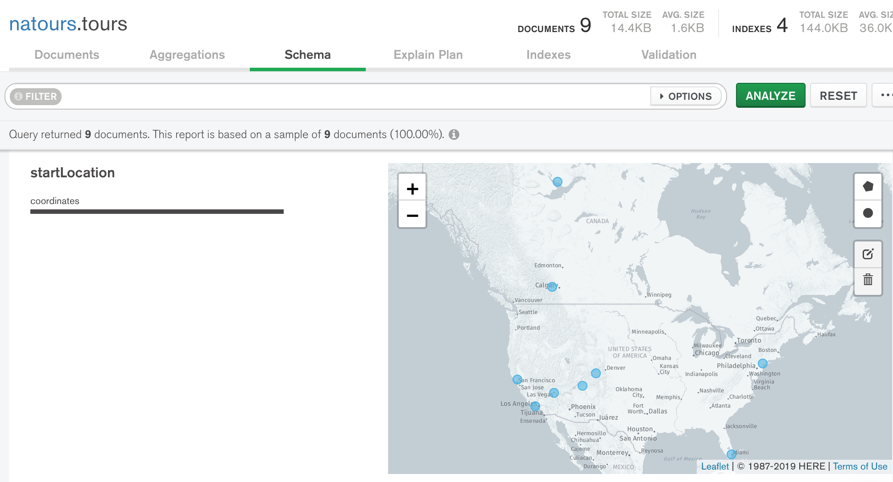

    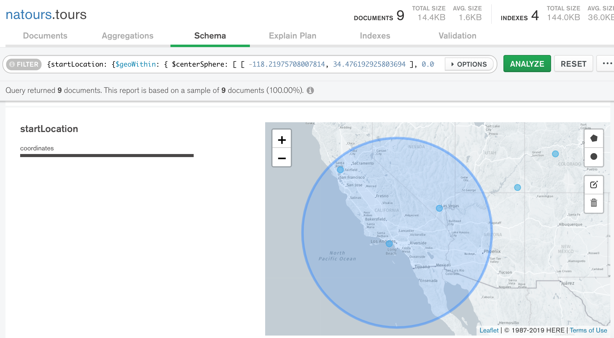

- ### Aggregation

  In here, we want to calculate distances to all tours from a point

  ```js
  // in tourRoutes.js
  router
    .route('/distances/:latlng/unit/:unit')
    .get(tourController.getDistances);

  // part of getDistances in tourControllers.js
  const distances = await Tour.aggregate([
    {
      $geoNear: {
        near: {
          type: 'Point',
          coordinates: [lng, lat],
        },
        distanceField: 'distance',
        distanceMultiplier: unit === 'mi' ? 0.000621371 : 0.001,
      },
    },
    {
      $project: {
        distance: 1,
        name: 1,
      },
    },
  ]);
  ```

# API FEATURES

-There are 2 ways to query data in `MongoDB` db using `Mongoose`

- Method 1: Pass the query object into the `.find()` method:
  ```js
  const tours = await Tour.find({
    duration: '5',
    difficulty: 'easy',
  });
  ```
- Method 2: Chaining special `Mongoose` methods for Query Object to build the query similar to what we have above

  ```js
  const tours = await Tour.find()
    .where('duration')
    .equals(5)
    .where('difficulty')
    .equals('easy');
  ```

-Endpoints with query strings:

- /api/v1/tours?duration=5&difficulty=easy, the query part starts from `?` so the query string is duration=5&difficulty=easy => equivalent to `{ difficulty: 'easy', duration: '5' }` when querying in Mongo Shell
- /api/v1/tours?duration[gte]=5&difficulty=easy: `{ duration: {$gte: 5}, difficulty: "easy" }`

-In `Express`, this query string is stored in `req.query`, which for the two example above will look like this `{ duration: '5', difficulty: 'easy' }` and `{ duration: { gte: '5' }, difficulty: 'easy', page: '2' }`. It's missing `$` for the operator `gte`.

## [FILTERING](https://github.com/ngannguyen117/Node.js-Bootcamp/commit/73548f2da7911d00748ea36354ff2f9da5d07a3f)

-For filtering, since `req.query` is a query object already, we can easily pass it into `.find()` like in method 1 => `const tours = await Tour.find(req.query);`

-However, if the query string contains other options such as sorting or pagination, then simply passing `req.query` into `find` won't work. To make it work, we need to remove them out from the query

```js
const queryObj = { ...req.query }; // make a copy: destruring req.query and then put them in an object
const excludedFields = ['page', 'sort', 'limit', 'fields'];
excludedFields.forEach((field) => delete queryObj[field]);

let queryStr = JSON.stringify(queryObj);
queryStr = queryStr.replace(
  /\b(gte|gt|lte|lt)\b/g,
  (matchStr) => `$${matchStr}`
);
const query = Tour.find(JSON.parse(queryStr)); // the function find() returned a Query object

const tours = await query;
```

-The function `.find()` of a Mongoose Model returned a `Query` object. As soon as we use `await` on the returned Query Object, the query then will be executed and comes back with the documents that matches the query. So if we `await Tour.find(queryObj)`, we won't be able to chain other method to sort or limit fields. Thus, we save the Query into an object. Only when we finish chaining, we will `await` the Query and get the final result.

-`/\b(gte|gt|lte|lt)\b/g`: a regular expression in JS. `\b` is to match the exact string specify inside `()`. `g` is to make it happen multiple time. That is if there are multiple matches of any of the terms in `()`, it will replace all of them

## [SORTING](https://github.com/ngannguyen117/Node.js-Bootcamp/commit/4fa63e0f5c83f6a9a90285be58456f71418a5e2a)

- `sort=price`: sort by price in ascending order
- `sort=-price,ratingsAverage`: sort by price in descending order, if there's a tide, sort them by ratingsAverage

```js
if (req.query.sort) {
  const sortBy = req.query.sort.split(',').join(' ');
  query = query.sort(sortBy);
} else {
  query = query.sort('-createdAt');
}
```

## [LIMITING FIELDS](https://github.com/ngannguyen117/Node.js-Bootcamp/commit/f28ba50516bb9f16ae79848cbfc53b766465ef17)

- Proving limiting fields option so that users can reduce fields that are unnecessary for them to lower data size sent back to them
- `fields=name,duration,difficulty,price`: query will only project fields name, duration, difficulty, & price
- `fields=-name,-__v`: query will exclude name and \_\_v
- We can also exclude fields directly from Schema by adding `select: false` in Type Option for fields we never want clients to see such as password or when a tour was created.
  ```js
  if (req.query.fields) {
    const fields = req.query.fields.split(',').join(' ');
    query = query.select(fields);
  } else {
    query = query.select('-__v');
  }
  ```

## [PAGINATION](https://github.com/ngannguyen117/Node.js-Bootcamp/commit/c57cc9706d5f72f8db926519fa5cd6c6b2652f1d)

- Pagination allows users to select a certain page from the result in case we have a lot of results
- `page=2&limit=10`: return page #2, each page contains 10 results

  ```js
  const page = req.query.page * 1 || 1;
  const limit = req.query.limit * 1 || 100;
  const skip = (page - 1) * limit;

  if (req.query.page) {
    const numTours = await Tour.countDocuments();
    if (skip >= numTours) throw new Error('This page does not exist');
  }

  query = query.skip(skip).limit(limit);
  ```

## [ALIASING](https://github.com/ngannguyen117/Node.js-Bootcamp/commit/ec56301a12242a80785aa0306267053d32107f62)

- A nice feature to add to an API is to provide an alias to a route request that might be popular and be requested all the time
- For example: 5 best tours `limit=5&sort=-ratingsAverage,price`
- In this example, this alias is part of the `tours` resource, so the endpoint will be `api/v1/tours/top-5`

  ```js
  // In tourRoutes.js, we create a new route for top-5 with a GET method
  // Before running getAllTours, it will go through middleware aliasTopTours that will insert
  // some queries to the req object. This makes it easy so that the users don't have to write them
  router
    .route('/top-5')
    .get(tourController.aliasTopTours, tourController.getAllTours);

  // In tourController.js
  exports.aliasTopTours = (req, res, next) => {
    req.query.limit = '5';
    req.query.sort = '-ratingsAverage,price';
    req.query.fields = 'name,price,ratingsAverage,summary,difficulty';
    next();
  };
  ```

## [APIFeatures Module](https://github.com/ngannguyen117/Node.js-Bootcamp/commit/06aed2fababf8b63bdfe0fe843ab573f43e3b6b3)

-Group all of the above features in a APIFeatures class so that it can be independent and reusable in other endpoints/modules

-To use the features, we only need to chain them like this

```js
const features = new APIFeatures(Tour.find(), req.query)
  .filter()
  .sort()
  .limitFields()
  .paginate();
const tours = await features.query;
```

# Authentication, Authorization and Security

## Security Best Practices

  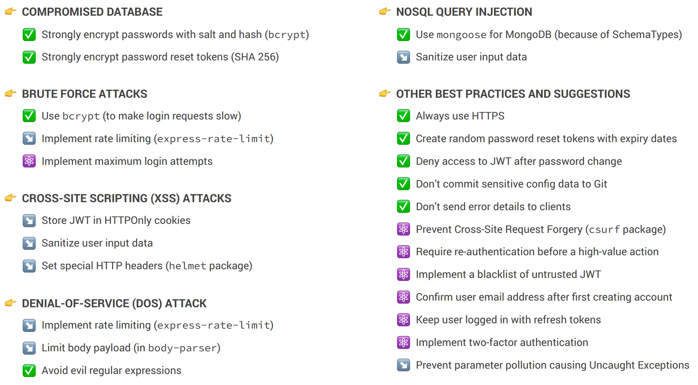

- **Brute Force attacks**: hackers try to log in using all different combinations of passwords until they find the right one
- **Cross-site Scripting attacks**: hackers inject scripts into our page to run their malicious code. This is especially dangerous for the clients because it allows the attackers to read local storage. This is why we should never store JWT in local storage. JWT should only be stored in an HTTP-only cookie so that the browser can only receive and send cookies but cannot access or modify it in anyway.
- **Denial-of-service attack**: hackers send many requests to a server to break down the server and the application becomes unavailable
- **NOSQL query injection**: An query injection happens when an attacker, instead of inputting valid data, injects some queries in order to create query expresstions that'll translate to true. For example, to be logged in without providing a valid username or password

## [Create new users and manage passwords](https://github.com/ngannguyen117/Node.js-Bootcamp/commit/b56a24ff59d48c8bdc9369894c514bf3f00f7720)

- Validate email and passwords matching in the Schema
- Add a pre hook on `save` event to hash the password and delete the `passwordConfirm` field
  - Delete `passwordConfirm` by `this.passwordConfirm = undefined;`. We only need passwordConfirm to match the password but there's no need to save it in the db.
  - As for the password, we should never save it as is in db in case the db is hacked and the users' passwords are stolen.
  - Use `bcryptjs` npm package to encrypt password `this.password = await bcrypt.hash(this.password, 12);`. The number `12` is to define how CPU intense the hash function will be, called `salting`. The bigger the number, the longer it takes to hash and the more secure it is. This also ensure even if 2 users have the same password, the hashed passwords won't be the same.
- If passing the same password in giving us different hashed value, how can we check if the password is the same when logging the users in? `bscript` has a function call `compare` that will compare the inputPassword with the hashed password in db. By creating a static method in userShema, all User documents can have access to this function
  ```js
  userSchema.methods.correctPassword = async function (
    candidatePassword,
    userPassword
  ) {
    return await bcrypt.compare(candidatePassword, userPassword);
  };
  ```

## [How Authentication with JWT works](#)

- Authentication - Authorization: The whole workflow of logging user in and allowing them to interact with certain protected resources that non-logged in users cannot access
- The authentication we're gonna use is called JWT - Json Web Token (`jsonwebtoken` npm package), a stateless solution for authentication so there's no need to save any session state in the server which is perfect for RESTful APIs.

  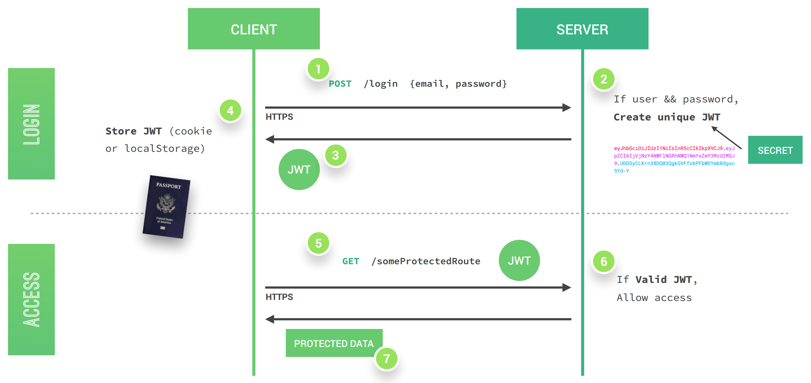

  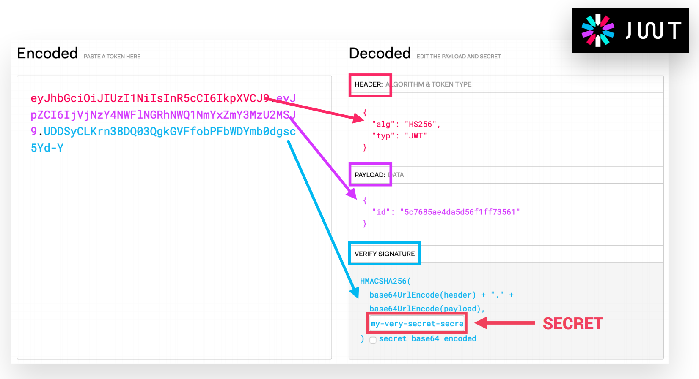

  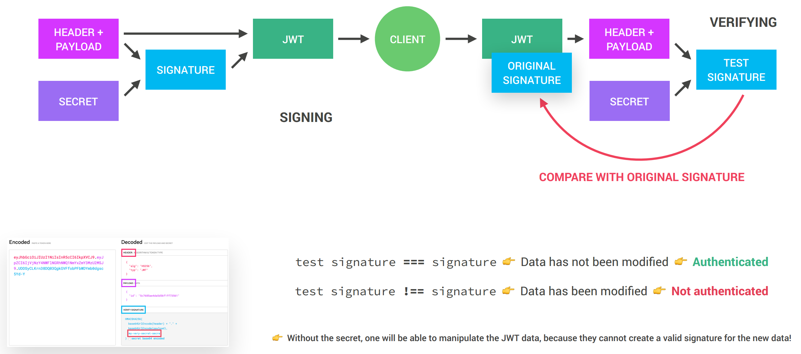

- ### [Signing up Users](https://github.com/ngannguyen117/Node.js-Bootcamp/commit/3875294a049e13de50a78540ed2d08dc0417527b)

  - The previous way of creating a new user: `const newUser = await User.create(req.body);`. The flaw of this way is that it allows any users to register themselves as an admin so it's not secure. We can fix it by specifically indicate which fields we want to input data in. So if someone try to insert a new row, we will not save it into the db. If we want to set a user as an admin, we can manually do it in Compass

    ```js
    const newUser = await User.create({
      name: req.body.name,
      email: req.body.email,
      password: req.body.password,
      passwordConfirm: req.body.passwordConfirm,
    });
    ```

  - Before returning the newUser data, we `sign` jwt and return the token to log the new user in
    ```js
    const token = jwt.sign({ id: newUser._id }, process.env.JWT_SECRET, {
      expiresIn: process.env.JWT_EXPIRES_IN,
    });
    ```

- ### [Authentication Step 1: Logging in Users](https://github.com/ngannguyen117/Node.js-Bootcamp/commit/3ab92b1c4af243ece68388b2e48f5f324ae9ded8)

  To log a user in, we need to check for their email, password then return a token to the client

  ```js
  exports.login = catchAsync(async (req, res, next) => {
    const { email, password } = req.body;

    if (!email || !password)
      return next(new AppError('Please provide email and password!', 400));

    const user = await User.findOne({ email }).select('+password');

    if (!user || !(await user.correctPassword(password, user.password)))
      return next(new AppError('Incorrect email or password', 401));

    const token = signToken(user._id);
    res.status(200).json({
      status: 'success',
      token,
    });
  });
  ```

- ### [Authentication Step 2: Let logged-in users access protected routes](https://github.com/ngannguyen117/Node.js-Bootcamp/commit/55933fbc00c3f81425d2cc0b08ecb1c510662ed3)

  To make a route a protected route, all we have to do is to insert an authenticating handler (middleware) before the main handler of that route for example: `.get(authController.protect, tourController.getAllTours)`.

  This authenticating handler will verify the token included in the header. If the verification passed, we check if the user still exists or if the user has changed password after the token is issued before allowing access to the protected route.

  ```js
  exports.protect = catchAsync(async (req, res, next) => {
    // 1 - Getting token and check if it exists
    let token;
    if (
      req.headers.authorization &&
      req.headers.authorization.startsWith('Bearer')
    )
      token = req.headers.authorization.split(' ')[1];

    if (!token) {
      return next(
        new AppError('You are not logged in. Please log in to get access', 401)
      );
    }

    // 2 - Verify token
    const decoded = await promisify(jwt.verify)(token, process.env.JWT_SECRET);

    // 3 - Check if user still exists
    const currentUser = await User.findById(decoded.id);
    if (!currentUser)
      return next(
        new AppError('The user belonged to this token no longer exists', 401)
      );

    // 4 - Check if user changed password after token was issued
    if (currentUser.changedPasswordAfter(decoded.iat))
      return next(
        new AppError('User recently changed password. Please log in again', 401)
      );

    // 5 - Grant access to protected route
    req.user = currentUser;
    next();
  });
  ```

- ### [Authorization: User Roles and Permissions](https://github.com/ngannguyen117/Node.js-Bootcamp/commit/a4f666c0927deb176af9949d1e5c6e0d2d9e28ac)

  Authorization: allows certain users to have the right to access certain resources. For example, only admin should be able to delete/add a tour.

  ```js
  // tourRoutes.js, delete Method is restricted to admin and lead-guides
  router
    .route('/:id')
    .delete(
      authController.protect,
      authController.restrictTo('admin', 'lead-guide'),
      tourController.deleteTour
    );

  // authController.js
  exports.restrictTo = (...roles) => {
    return (req, res, next) => {
      // roles is an array: ['admin', 'lead-guide']
      if (!roles.includes(req.user.role))
        return next(
          new AppError('You do not have permission to perform this action', 403)
        );
      next();
    };
  };
  ```

- ### Password Reset Functionality

  - #### [Reset Token & Reset password link](https://github.com/ngannguyen117/Node.js-Bootcamp/commit/843fd4ae11d79e4d7c09e5432a4553360048bf23)

    User send a POST request to change password through `users` resource at endpoint `/forgotPassword`.
    We generate a token that acts as a temporary password and then send an email to the user with a link to reset the password.

    - **Create a reset token**

      Since the token acts as a password, we cannot save it to db as is. We'd need to encrypt it just like a real password so that if a hacker gets access to the token, he cannot change your password.

      So we save the encrypted reset token in db, send the original to the user. When the user click on the link (which includes the original token), we will compare the token with the encrypted one, if it matches, we will allow the user to change password.

      `await user.save({ validateBeforeSave: false });`: we need to save to db all the changes we made (inserting reset token). Since everytime we do user.save(), it will validate if it includes all the required fields like `passwordConfirm`, we need to ignore validation to make this save work.

      ```js
      // userModel.js, create an instant method to create a reset token
      userSchema.methods.createPasswordResetToken = function () {
        const resetToken = crypto.randomBytes(32).toString('hex');

        this.passwordResetToken = crypto
          .createHash('sha256')
          .update(resetToken)
          .digest('hex');

        this.passwordResetExpires = Date.now() + 10 * 60 * 1000;

        return resetToken;
      };

      // authController.js, forgotPassword handler
      const user = await User.findOne({ email: req.body.email });
      if (!user)
        return next(
          new AppError('There is no user with that email address', 404)
        );
      const resetToken = user.createPasswordResetToken();
      await user.save({ validateBeforeSave: false });
      ```

    - **Send user an email with a reset password link**

      Changes are made in `forgotPassword` handler in `authController.js` and util `email.js`

      Generate a resetURL which includes the token created in the previous step. Then use `nodemailer` package to send user an email with resetURL.

      During development, we use `mailtrap` to trap the outgoing emails so that we don't accidentally send wrong emails to users.

  - #### [Setting New Password](https://github.com/ngannguyen117/Node.js-Bootcamp/commit/2e8a9818c3716987b31d31b1ef5133fd99265210)

    User send a PATCH request with token as a param to update new password

    We add a new pre hook to User Model on `save` event to insert/update `passwordChangedAt` since the user is changing their password.

    In `resetPassword` handler from `authController.js`, we encrypted the token param and search for the user with that token in db. Then we update with the new password and return a new authentication token.

- ### Current user updates their account:

  - #### [Password](https://github.com/ngannguyen117/Node.js-Bootcamp/commit/6a56cdbee7c403fae9dc3de760643abc36a59c66)

    Route: PATCH `/updateMyPassword`

    This route is different from resetPassword because users only have access to this option once they're logged in. Additionally, before allowing the password to be updated, we ask users for the current password to ensure that's not a hacker.

    Handler: `updatePassword` in `authController.js`. Steps:

    - Get user from db based on user ID in the request. We have access to `user` variable in request because we call middleware `authController.protect` to authenticate user before calling this handler
    - Compare the password in db with passwordCurrent in request body.
    - If it's the same, we update the password and return a new JWT

  - #### [Other Data](https://github.com/ngannguyen117/Node.js-Bootcamp/commit/31b1477daf34c09715c6613a28da14eee29ce1c3)

    Route: PATCH `/updateMe`. This route allows user to update their own account so we also need to run it through `authController.protect`.

    Handler: `updateMe` in `userController.js`. In here, we want to make sure to only update the allowed fields in case user adding a `role` field. We also don't want to use `.save()` because it will cause an error in `passwordConfirm` field. For what we're updating, using `User.findByIdAndUpdate` would suffice.

  - #### [Delete Account](https://github.com/ngannguyen117/Node.js-Bootcamp/commit/d41a56bb937e7641d191e6b06550dd997f6c65e9)

    Route and handler called `deleteMe`

    When a user requests to delete their account, we don't actually delete their document from the db, we only set it to inactive so that if they decide to open an account again, we still have all of their information.

    Because of this new `active` field, we need to have a pre query middleware on `find` so when we query for users, we don't show users that's inactive

## [Sending JWT via Cookie](https://github.com/ngannguyen117/Node.js-Bootcamp/commit/75ef700678e66b7952d37fe1860e8fe0a7ffccbe)

- **Cookie**: A cookie is a small piece of text that a server can send to a client. When a client receives a cookie, it will automatically store it and send it back along with all future requests to the same server.
- In `createSendToken` in `authController.js`, we will create and send a http-only cookie before sending a response to the client.
- `'jwt'`: cookie name, `token`: data in the cookie
- `expires`: in milliseconds, for browser to delete cookie when it's expired. We need a new `JWT_COOKIE_EXPIRES_IN` as an environment because the `JWT_EXPIRES_IN` is in a format for JWT package but in JS, it's meaningless
- `secure: true`: the cookie will only be sent on a encrypted connection `https`
- `httpOnly: true`: the cookie cannot be accessed or modified in any ways by the browers to prevent XSS attacks. The browser receives the cookie, store it and then send it automatically along with every request

  ```js
  const cookieOptions = {
    expires: new Date(
      Date.now() + process.env.JWT_COOKIE_EXPIRES_IN * 24 * 60 * 60 * 1000
    ),
    httpOnly: true,
  };
  if (process.env.NODE_ENV === 'production') cookieOptions.secure = true;

  res.cookie('jwt', token, cookieOptions);
  ```

- Everytime a browser send a request to a server, it will always send all the cookies it has on that website along with the request. That means we will have the `jwt` in the cookie for authentication.
- To access the cookies sent by browsers, we need to use `cookie-parser` npm package in the express app. Include it and then use it with the body parser: `app.use(cookieParser());` for cookies to be added to req
- For the server to authorize users based on JWT token, we need to add this `else if (req.cookies.jwt) token = req.cookies.jwt;` to the `protect` method of `authController.js`

## [Rate Limiting](https://github.com/ngannguyen117/Node.js-Bootcamp/commit/4a6beb1303a0687e1219c5b1c8c32ad080170294)

- Rate Limiter prevents the same IP address making too many requests to the APIs to help us from denial of service or brute force attacks
- We will implement rate limiter as a global middleware in `app.js` using `express-rate-limit` package. The rate limiter will count the number of requests coming from the same IP address so when there are too many requests, we block them

```js
const limiter = rateLimit({
  max: 100,
  windowMs: 60 * 60 * 1000,
  message: 'Too many requests from this IP. Please try again in an hour',
});
app.use('/api', limiter);
```

## [Security HTTP Headers](https://github.com/ngannguyen117/Node.js-Bootcamp/commit/75ef700678e66b7952d37fe1860e8fe0a7ffccbe)

- Use `helmet` package to set security HTTP Headers as a middleware because Express doesn't have those builtin
- We should always use `helmet` at the begining of the middleware stack to make sure the APIs are called secured

## [Data Sanitization](https://github.com/ngannguyen117/Node.js-Bootcamp/commit/bb97beeb87a1ba38f75c34804b523fe28c21f3c7)

- Data sanitization means to clean data coming to the application from malicious code.
- **NoSQL Query Injection Attack**

  - Example: We can log in with this even though we didn't provide any valid email (password is correct)

    ```js
    {
      "email": { "$gt": "" },
      "password": "pass1234"
    }
    ```

  - Use `express-mongo-santitize` package to prevent this kind of attack

    ```js
    app.use(mongoSanitize());
    ```

- **XSS**

  - `app.use(xss());`, from `xss-clean` package, will clean any user input from malicious HTML, JS code
  - Example: if we sign up with `"name": "<div id='bad-code'>Name</div>"`, xss-clean will convert special characters into something like this `"name": "&lt;div id='bad-code'>Name&lt;/div>"`

## [Preventing Parameter Pollution](https://github.com/ngannguyen117/Node.js-Bootcamp/commit/fbe55c31309d1429e54e77c6f12a8b6183f4d837)

- Example: if we were to send a request with sort by duration and sort by price `api/v1/tours?sort=duration&sort=price`, in the parameters, we'd get an array `['duration', 'price']` for `this.queryString.sort`. In the next line of code, we were supposed to split a string but `this.queryString.sort` is an array, thus, Nodejs throws an error.

- Use `hpp` package (http parameter pollution) to remove duplicate. We should use it at the end of the stack to make sure it will clean the query string

- However, query something like this should work `duration=5&duration=9` because we can get any tours with duration = 5 AND 9, but just using `app.use(hpp());` will remove the duplicate so we need to whitelist some parameters

  ```js
  app.use(
    hpp({
      whitelist: ['duration'],
    })
  );
  ```

# SERVER-SIDE RENDERING with Pug Templates

Up to this point, we've been building APIs for the application. Starting in this section, we will build the website on the server. We'll build the html files b/c that's where the data will be stored. We'll be using templates and inject data whenever neccessary.

Ex: When there's a request, ex: homepage, we get the neccessary data from the db, inject it into the template, which will output an html, then send that html along with css, js, and images to the browser.

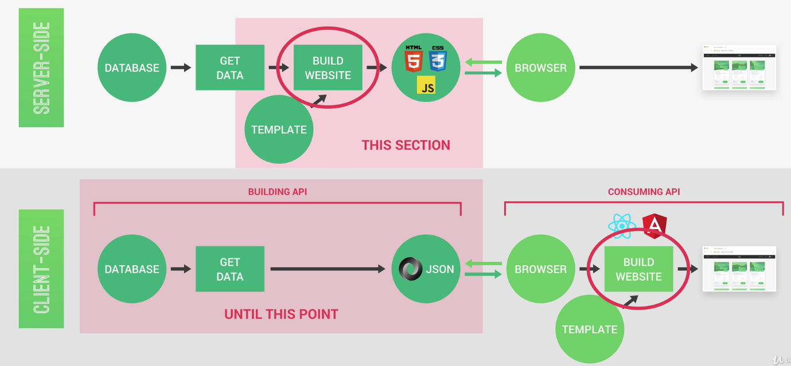

## Pug: Template Engine to Render Website

- ### Setup Pug

  `Pug` is a template engine npm package very popular to use with Express. To use it, we need set the express app `view engine` to `pug` and tell Express where we save the views at. There's no need to require `pug` to use it.

  ```js
  app.set('view engine', 'pug');
  app.set('views', path.join(__dirname, 'views'));
  ```

  **How do we access the template?** We need to add a new route to access templates. Here, in the `res`, instead of return a json response, we render the file `base`. Since we told Express to render views from the `views` folder, Express then go into view folders and look for the file match that name.

  ```js
  app.get('/', (req, res) => {
    res.status(200).render('base'); // base.pug in views folder
  });
  ```

  To pass data into the template, we include an object with the name of the template. The data passed in here will be available in the `pug` files as local variables with the names we define here

  ```js
  app.get('/', (req, res) => {
    res.status(200).render('base', {
      tour: 'The Forest Hiker',
      user: 'Ngan',
    });
  });
  ```

- ### Intro to Pug

  `pug` is a simple white space sensitive syntax for writing HTML. To write HTML elements is to write their names and indentations in our code.

  ```js
  doctype html
  html
    head
      title Natours
      link(rel='stylesheet' href='/css/style.css')

    body
      h1= tour // buffered code, will be rendered, we can also use js here
      h2= user.toUpperCase()
      - const x = 9 // unbuffered code which will not be rendered
      h2= 2 * x
      p This is just some text for #{tour} // #{} template string for pug
  ```

  By using middleware `express.static` in `app.use(express.static(path.join(__dirname, 'public')));`: we defines all the static assets will always be served from the folder `public`. So the route for `css/style.css` which ends in `.css` requests a static file. That's why Express knows to go to folder `public` to look for it.

  There are 2 types of comments in pug. `// The Park Camper` will result as a HTML comment `<!-- h1 The Park Camper-->` and it is visible when you view the file as html document. If you want it to just be a `pug` comment, use an extra dash `//- The Park Camper`

- ### Include Files into Pug Templates.

  Since we will be using the same header, and footer in mulitple templates, we can save them in their own template as `_header.pug` and then include them in another template by `include _header` in `base.pug`

  We also can use VSCode extension `Pug beautify` to edit indentations

- ### Extend Base Template with Blocks

  Using extend to use the same base layout for all the page we render. Each file can only extend one other file but we can have multiple blocks

  In `base.pug` body, we put a block to save that space for the actual content.

  ```
  block content
    h1 This is a placeholder heading
  ```

  In the template that extends `base` like overview or tour. Whatever inside the block content of overview/tour will override the content in base. However, if we write `block append content`/`block prepend content` then the content in tour will append at the end/start of whatever already in base

  ```
  extends base

  block content
    h1 This is the tour overview
  ```

## [Include a map in Tour Detail Page with Mapbox](https://github.com/ngannguyen117/Node.js-Bootcamp/commit/639d69c63dbd2b9313855e0f1a8f547b1908997b)

Since service from `mapbox.com` runs in frontend, we'll be writing code in JS and this will belong to the `public` folder
then it will be integrated into a template file.

We include this script at the end of `base.pug` for it to load the mapbox.js file into HTML file

```
script(src='/js/mapbox.js')
```

In our view page for tour, we need a div with an ID `map` (by default) with `mapbox` so that the map from mapbox will be loaded into that div.

Then we create a map based on mapbox documentation which can be found at [link](https://docs.mapbox.com/mapbox-gl-js/api/)

## [Log in Users with API](https://github.com/ngannguyen117/Node.js-Bootcamp/commit/d340cf5bcd457ee2fef80def8bb2a340450bf074)

- **`Frontend`**: Create a `login.js` file. Use `axios` to make a POST request to `/api/v1/users/login` when user click the button `LOG IN` in the log in page. Use JS to extract email, password values from the HTML form to use for logging in.

  We only want to reload/redirect the page if we successfully logged in

  ```js
  if (res.data.status === 'success')
    window.setTimeout(() => {
      location.assign('/');
    }, 1500);
  ```

  We now use `parcel` bundler as a dev dependency to bundle our JS files so that we only include 1 main js file to our html. In package.json, write a watch script `"watch:js": "parcel watch ./public/js/index.js --out-dir ./public/js --out-file bundle.js"`

- **`Backend`**: Conditionally render `log in` and `sign up` btn when user is not logged in, otherwise display user menu and log out option. This will be done in pug template.

  User a new middleware in `viewRoutes.js` to check if the user is logged in or not. `router.use(authController.isLoggedIn);`

  ```js
  exports.isLoggedIn = catchAsync(async (req, res, next) => {
    if (req.cookies.jwt) {
      // 1 - Verify token
      const decoded = await promisify(jwt.verify)(
        req.cookies.jwt,
        process.env.JWT_SECRET
      );

      // 2 - Check if user still exists
      const currentUser = await User.findById(decoded.id);
      if (!currentUser) return next();

      // 3 - Check if user changed password after token was issued
      if (currentUser.changedPasswordAfter(decoded.iat)) return next();

      // There is a logged in user
      res.locals.user = currentUser;
    }
    next();
  });
  ```

  The pug template have access to `res.locals` so whatever we put into locals in the handler, we can then get them in pug template. Here's in `_header.pug`, it has access to variable user we added to locals above

  ```js
  if user
    a.nav__el.nav__el--logout Log out
    a.nav__el(href="#")
      img.nav__user-img(src=`/img/users/${user.photo}` alt=`${user.name} photo`)
      span= user.name.split(' ')[0]
  else
    a.nav__el(href='/login') Log in
    a.nav__el.nav__el--cta(href='#') Sign up
  ```

## [Logging out users](https://github.com/ngannguyen117/Node.js-Bootcamp/commit/5c6e2e9446e13bdfce9127f6651259ddd285aedb)

When we were working with logging users in, to log out, we have to manually delete cookies from the browser. Since we cannot manipulate this http-only cookie, we have to create another route to log user out. In the response of this route, we send back a new cookie with the exact same name but without the token to overide the existing token in the browser

```js
exports.logout = (req, res) => {
  res.cookie('jwt', 'loggedOut', {
    expires: new Date(Date.now() + 10 * 1000),
    httpOnly: true,
  });
  res.status(200).json({ status: 'success' });
};
```

Similar to how we coded login, when user click logout, we send a GET request to `/users/logout` and the browser will receive a new token.

## [Update User Data directly from HTML form](https://github.com/ngannguyen117/Node.js-Bootcamp/commit/c521a4973046a291371678748aa88511cc9fa6d5)

Use traditional method to send POST request by indicating `action` in HTML form. This way is not recommended because it forces the page to reload and we have to create another route for it. So we're just doing it to know how to send a post request with HTML form

In HTML form, we need to add `action='/submit-user-data' method='POST'` to the `form` element and then add name attribute to any input we want to send data over to the request `name='email'`

For request to have that data in its body, in express, we need to add a middleware `app.use(express.urlencoded({ extended: true, limit: '10kb' }));`

In viewRoutes.js, we have to create a new route matching the action attribute `/submit-user-data`. And a handler in view controller to handle the request.

# ADVANCED FEATURES: Payments, Email, File Uploads

## [File Uploads with Multer - Backend](https://github.com/ngannguyen117/Node.js-Bootcamp/commit/c10fe3f823ae10f33aed0d56f82078fb96f28753)

`Multer` is a very popular middleware ([npm package](https://github.com/expressjs/multer)) to handle `multipart/form-data`, which is a form-encoding used to upload files from a form.

In the following code, we work with image but the configuration can be applied to any files.

```js
// userController.js
// diskStorage: save to the disk (not memory), in this case our file system
const multerStorage = multer.diskStorage({
  destination: (req, file, cb) => {
    // cb is a callback function
    cb(null, 'public/img/users');
  },
  filename: (req, file, cb) => {
    // user-userId-timestamp.jpeg
    const ext = file.mimetype.split('/')[1];
    cb(null, `user-${req.user.id}-${Date.now()}.${ext}`);
  },
});

const multerFilter = (req, file, cb) => {
  if (file.mimetype.startsWith('image')) cb(null, true);
  else cb(new AppError('Not an image! Please upload only images', 400), false);
};

const upload = multer({
  storage: multerStorage,
  fileFilter: multerFilter,
});

exports.uploadUserPhoto = upload.single('photo'); // upload just 1 single file

// to upload multiple images => req.files
upload.array('images', 5); // images: name of the field in db, 5: maxCount
upload.fields([
  { name: 'imageCover', maxCount: 1 },
  { name: 'images', maxCount: 3 },
]);

// userRoutes.js: we want to run this multer middleware for it to process and save the photo to our file system
router.patch(
  '/updateMe',
  userController.uploadUserPhoto,
  userController.updateMe
);

// updateMe handler of userController
// After uploadUserPhoto handler run, the req now has an object called file that has info of the newly uploaded file. We just need to add the new filename into the body before sending it to the db
const filteredBody = filterObj(req.body, 'name', 'email');
if (req.file) filteredBody.photo = req.file.filename;
```

## [Resizing Images with sharp](https://github.com/ngannguyen117/Node.js-Bootcamp/commit/55e631bbe60726d87c495c29d261e7f6c5d4dc6d)

`sharp` is an image processing library in node.js ([npm package](https://sharp.pixelplumbing.com/api-resize)).

To use sharp, we'll make some changes to multerStorage. Before, we save file to the disk. Now that we need the file to process the image, it'll not be efficient to take a trip to the disk to get the file to process. So we will save the uploaded file to memory (buffer). In this way, the file will be available at `req.file.buffer` and there is no `req.file.filename`

```js
// userRoutes.js
router.patch(
  '/updateMe',
  userController.uploadUserPhoto,
  userController.resizeUserPhoto, // we add this middleware to process the uploaded img
  userController.updateMe
);

// userController
const multerStorage = multer.memoryStorage();

exports.resizeUserPhoto = catchAsync(async (req, res, next) => {
  if (!req.file) return next();

  req.file.filename = `user-${req.user.id}-${Date.now()}.jpeg`;

  await sharp(req.file.buffer)
    .resize(500, 500)
    .toFormat('jpeg')
    .jpeg({ quality: 90 })
    .toFile(`public/img/users/${req.file.filename}`);

  next();
});
```

## [File Uploads - Frontend: Adding Image Uploads to Form](https://github.com/ngannguyen117/Node.js-Bootcamp/commit/3eb52a29fce0ea896ff4cac32bee8cd4ed9cd361)

In the `account.pug`, the option to change user's photo is part of the form to update user's data. If we were to do it traditionally, we would need to add one additional attribute `enctype='multipart/form-data'` besides `action` and `method` to make the req to get the image file.

In our API, we use `multer` to upload files and data from form. Since we're using API to process request to upload images and update data, we need to convert our data into `multipart/form-data`. We still use the same route `/updateMe`

```js
// account.pug: replace <a> with <input type='file'>
// We need name='photo' b/c multer expects that
input.form__upload(type='file', accept='image/*', id='photo', name='photo')
label(for='photo') Choose new photo

// index.js
if (userDataForm)
  userDataForm.addEventListener('submit', async (event) => {
    event.preventDefault();

    const form = new FormData();
    form.append('name', document.getElementById('name').value);
    form.append('email', document.getElementById('email').value);
    form.append('photo', document.getElementById('photo').files[0]);
    console.log(form);

    await updateSettings(form, 'data');
    location.reload(true);
  });
```

## [Sending Emails: Welcome Email, Reset Password Email](https://github.com/ngannguyen117/Node.js-Bootcamp/commit/fd6839c5c59bddbc29af8cd1d58e493532cc0d82)

`mailtrap`: Email delivery platform used during development process. It traps the outgoing mails as if the emails are delivered to the actual email.

`sendgrid`: Email delivery platform used for production. It will actually send emails to real email addresses.

`mailsac`: A service to create disposable emails to receive emails instantly without signing up. It's great to use to test with `sendgrid`

`nodemailer`: To send emails out using either `mailtrap` or `sendgrid`

`html-to-text`: Convert HMTL to text to send with the actual HTML template in case users prefers to view email as simple text.

To send HTML in email, we need to use inline styling.

## Credit Card Payments with Stripe

[Stripe documentation for checkout](https://stripe.com/docs/payments/checkout/one-time)

- ### [Stripe Workflow](#)

  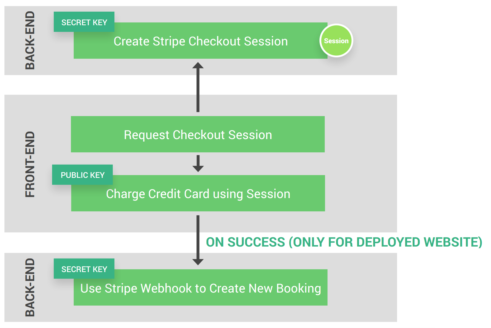

  - In the backend, we create a route for Stripe checkout session with the `secret key`. This session contains data about the object that can be purchase (i.e. `tour`) => session will contains tour price, tour name, image and some other data like client's email

  - In the frontend, we create a function to request the checkout session from the server once the user click the buy btn.

  - Once we hit the endpoint in the backend, a `Session` will be created and sent back to the client.

  - Based on that `Session`, Stripe will create a checkout page where the user can input payment info

  - Using that payment info, `Session` and the `public key`, Stripe charges the credit card. The credit card details never reaches our server which makes it easier for developers because we don't have to worry about secure credit card info.

  - Once the credit card has successfully being charged, we can use `Stripe Webhook` on the backend to create new booking. This part only works for deployed website
