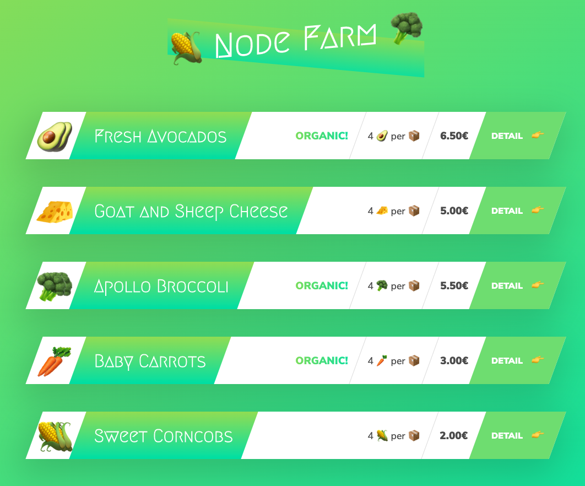
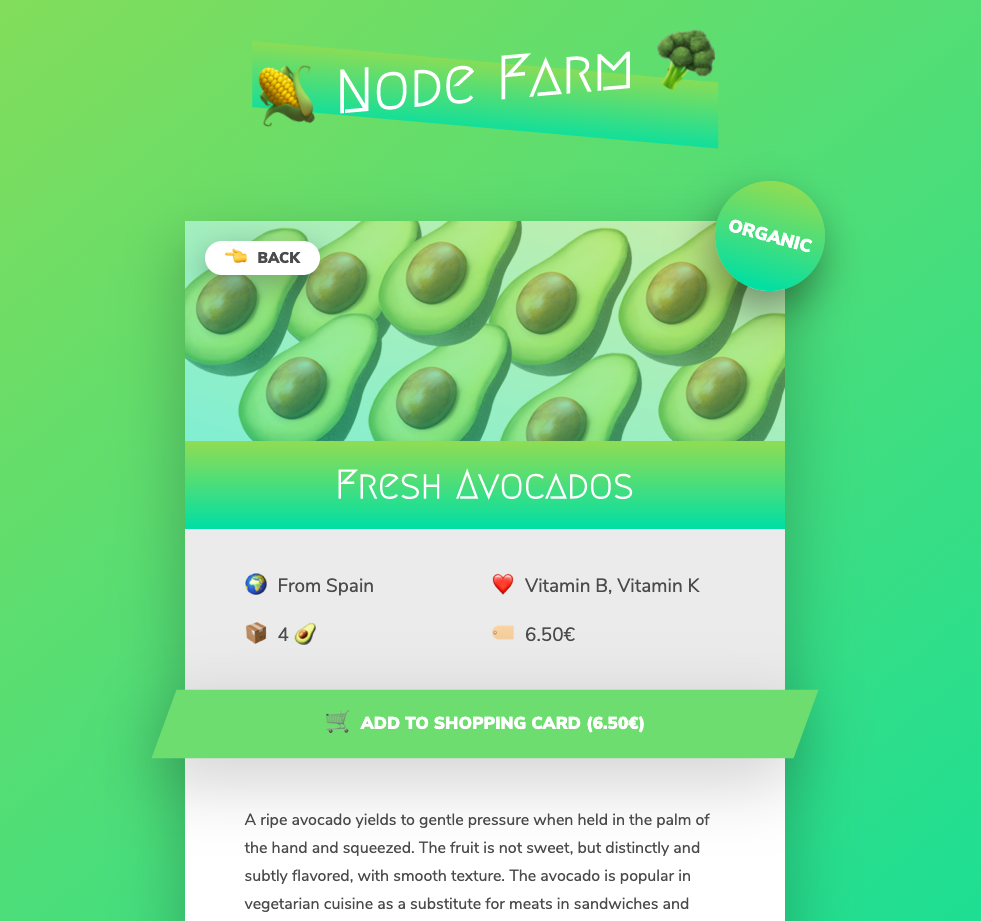

Notes during this project

- In node.js, use `require(...)` to import a module. Ex: `const fs = require('fs');` to import File System module

- ## <a href="https://github.com/ngannguyen117/Node.js-Bootcamp/commit/d67b8f1efa545b51dde4118c3b6293ec03b5a4b5">SYNCHRONOUS</a>

  - `fs.readFileSync` reading files synchoronously meaning before the program moves to the next line, it has to finish reading this file first
  - Read & write files synchoronously using fs module
  - Synchronous doesn't work well with Node.js because Node.js is single-threaded so if it waits for a line of code to be done before working on anything else, the rest of the code will be blocked and the program will be very slow.

- ## <a href="https://github.com/ngannguyen117/Node.js-Bootcamp/commit/90f702a19f18d17f1138661f9fc0f0d6e2e8c5a4">ASYNCHORONOUS</a>

  - In asynchronous code, the heavy work of that single line will be done in the background while the rest of the code will still be running. Once it is done, the call back function that was registered before will be executed. This way, that line will not block anything
  - `fs.readFile` and `fs.writeFile` reads/writes files asynchronously
  - `fs.readFile("./dev-data/data.json");` - in here, `.` refers to the directory where we run the node command. For example, if we run `node index.js` on desktop, then `.` is desktop, if we run it inside some folders, then `.` would be that folder => not ideal, it's better to use `dirname`
  - All node.js scripts have access to a variable called `dirname`, the directory of the current file being executed `` fs.readFile(`\${__dirname}/dev-data/data.json`); ``
  - the `.` in `require('./modules/replaceTemplate')` means the current directory of the module we're at

- ## <a href="https://github.com/ngannguyen117/Node.js-Bootcamp/commit/9b1deb280d4cbdb71fdd55441c7304a7d3672fec">Simple Web Server</a>

  - `const http = require('http');` - module that gives networking capability such as building a http server by calling `http.createServer(....)`
  - `createServer` takes a callback function that run everytime the server receive a request. Ex: `(req, res) => {...}`
    - `req` is the request from the browser
    - `res` is the response that the server will send back to the browser. We can write a header by `res.writeHead(...)` and include the content of the response in `res.end(...)`
  - For the server to receive request, the server has to listen and wait for requests, i.e. `server.listen(...)`

- ## <a href="https://github.com/ngannguyen117/Node.js-Bootcamp/commit/68254efa6deb44ba362e70aab6670635b10139e4">Routing</a>

  We create routes inside the callback function `(req, res) => {}` of `createServer`. Based on the value of `req.url`, we can use if statement to create different rounting. Ex:

  ```js
  const pathName = req.url;

  if (pathName === "/" || pathName === "/overview") {
    res.end("This is the overview");
  } else if (pathName == "/product") {
    res.end("This is the product");
  } else {
    res.writeHead(404, {
      "Content-type": "text/html",
      "my-own-header": "hello-word",
    });
    res.end("<h1>Page not found</h1>");
  }
  ```

  -`const url = require('url');` - url module is used to process url like parsing parameters etc

  -`url.parse(req.url, true)` is used to split the url into pathname and query object to make it easier to process the request

  ```js
  const { query, pathname } = url.parse(req.url, true);
  ...
  } else if (pathname == "/product") {
  res.writeHead(200, { "Content-type": "text/html" });
  const product = dataObj[query.id];
  const output = replaceTemplate(tempProduct, product);
  res.end(output);
  }
  ...
  ```

- ## <a href="https://github.com/ngannguyen117/Node.js-Bootcamp/commit/433b2c2215b3da5d6e606592fda88378426431ab">Build</a> and <a href="https://github.com/ngannguyen117/Node.js-Bootcamp/commit/78a6c9bce6cbf394544080d970e8550cd87b4ca1">Fill</a> <a href="#">HTML Templates</a>

  - Puting a placeholder in the html file so that we can later replace that placeholder with the data from the file we read. Ex: `<h2 class="product__name"></h2>`
  - `` is a placeholder. It can be anything as long as nothing like that appear in the html so we don't replace the wrong data
  - `let output = temp.replace(//g, product.productName)` - using regular expression `/.../g` makes sure all of the placeholders will be replaced, not just the first one if we were only using a string

- ## <a href="https://github.com/ngannguyen117/Node.js-Bootcamp/commit/83e77c79b58e956257e293e41677228730e6fcaf">Modules</a>

  - In node.js, every file is treated as a module
  - To use a module in another module, we need to export it. There are multiple ways to export a module
  - One of them is to assign whatever we what to export to `module.exports` (In each module, we have access to object called `module`). Ex: `module.exports = (input) => {... return output;}`
  - To use it in another module, we have to require it. In the case above, we can call it any names. Ex: `const replaceTemplate = require("./modules/replaceTemplate");`

- ## <a href="https://github.com/ngannguyen117/Node.js-Bootcamp/commit/cb1743355499673160401d554270ad2ed2ff415d">npm</a>

  - `npm` is a software that we use to manage third party open source packages used in the project
  - When we first start a project, we write `npm init` in command line in the current project folder to initialize npm as the project manager for the project. It will create a file named `package.json`, a configuration file including many infomation about the project is stored.
  - The open source packages that we include and use in our project are called dependencies because we depend on these packages for our project to work. `package.json` keeps track of these dependencies. There are two kinds of dependencies

    - Regular dependencies - packages needed for development & production for project to run

      Ex: `npm install slugify`

    - Development dependencies - packages used while developing the project but not needed in production

      Ex: `npm install nodemon --save-dev`

    ```
    "dependencies": {
      "slugify": "^1.4.0"
    },
    "devDependencies": {
      "nodemon": "^2.0.3"
    }
    ```

  - There are 2 types of installs:
    Local - The packages we install only work in the current project. For example, if we want to use `slugify` or `nodemon` in another project, we need to do npm install again. If we only install `nodemon` locally, we cannot use the `nodemon` command line. We need to write a npm script in `package.json`. Then type `npm run start` to run the script `start`

    ```
    "scripts": {
      "start": "nodemon index.js"
    }
    ```

    Global - The packages will be available in all projects to use. We should install a package globally when we want to use it in command line (usually used during development). For example, we can use `nodemon` in multiple projects, so we should install it globally by `npm i nodemon --global`. After installing `nodemon` globally, we can type `nodemon index.js` to start the server from the command line. `nodemon` will keep watching for changes and restart the server whenever we hit save.

  - How to require a 3rd party module from npm:
    `const slugify = require('slugify');`
  - Package Versioning and Updating
    - "^2.0.3": major version (2) - minor version (0) - patch version (3)
    - Path versions: fix bugs
    - Minor versions: introduce some new features but does not include breaking changes. These new features are backward compatible i.e. it will not break our code
    - Major versions: Huge new release with breaking changes - it might break code because it might not be compatible with what we have before.
    - `^`: this first character of the version specify which versions of the update we accept for our project. `^`: accept patch and minor releases. `~`: accept patch versions only. `*`: All versions. Best to use `^`
    - Check if we need to update by `npm outdated`. If there's new releases, it will display a table with all outdated packages. To update: `npm update slugify`
    - We can also install a package at a specific version. Ex: `npm install slugify@1.0.0`
    - To delete: `npm uninstall slugify`
    - `npm install`: install all dependencies in `package.json` when we open this project from another laptop

- Screenshots (HTML & CSS was provided)

  

  
